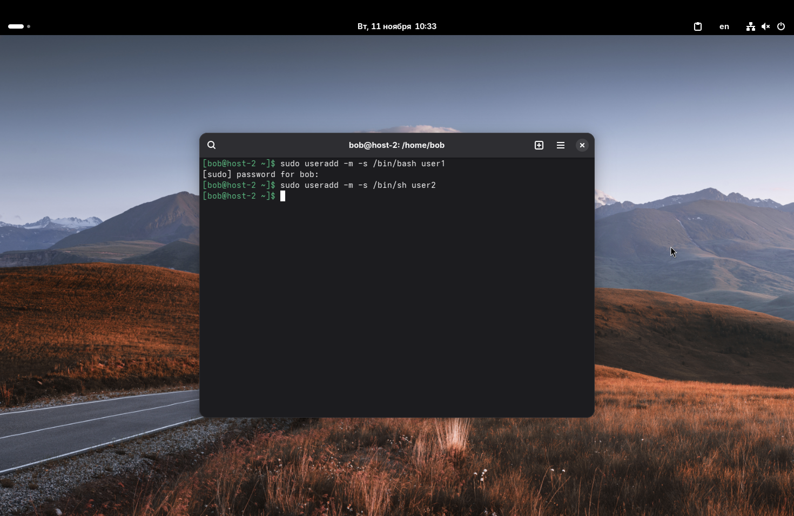
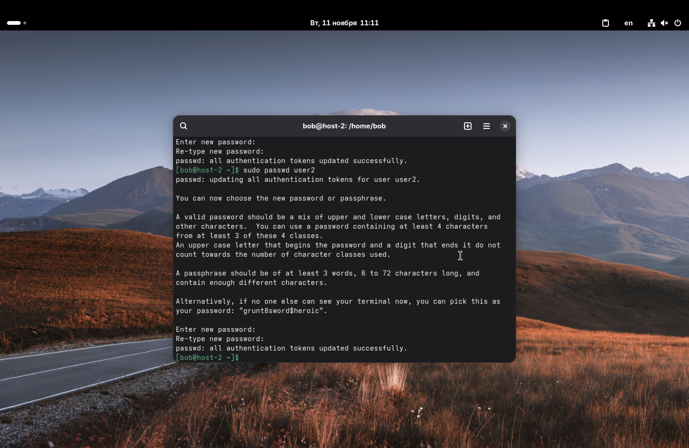
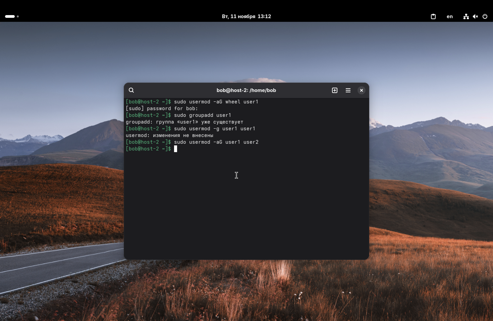
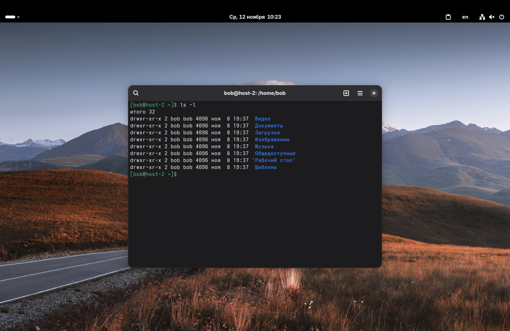
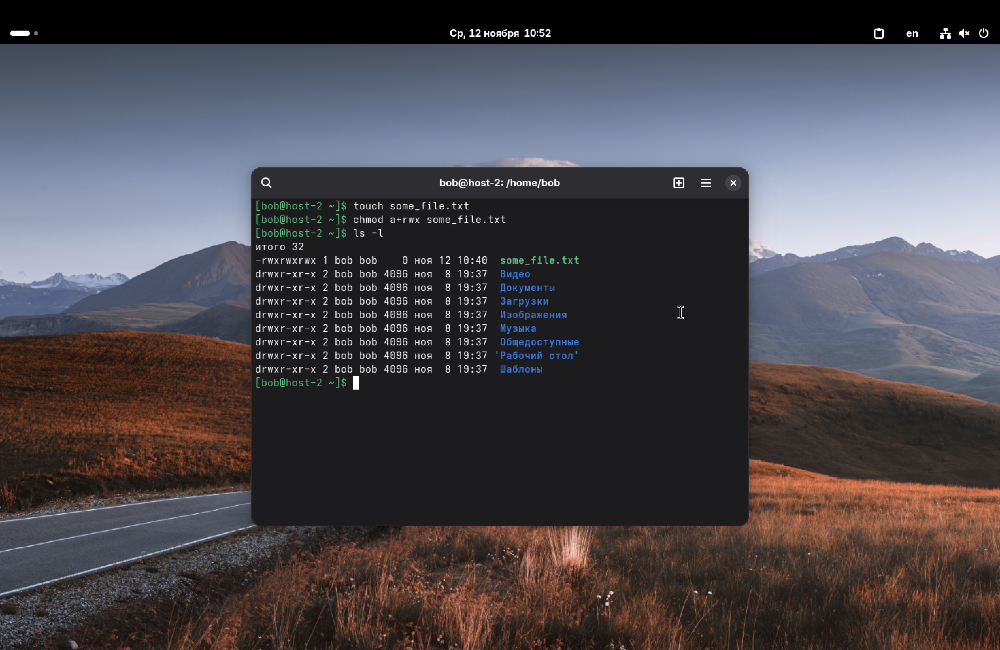
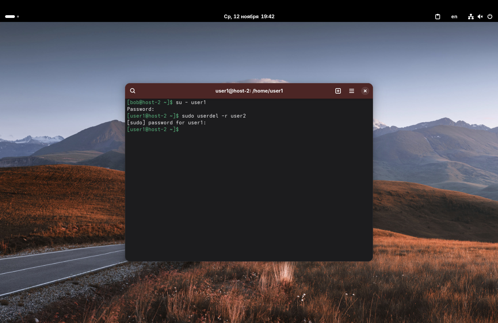
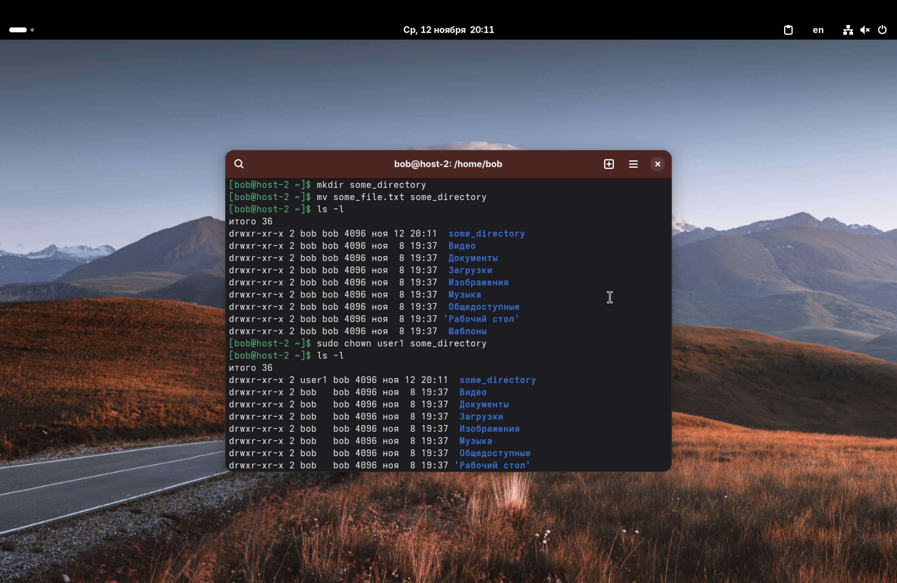

*Первую лабу делал на ноуте на винде, теперь работаю с мака, поэтому* 
\[bob@host-3 ~]$ *сменился на* \[bob@host-2 ~]$. *Также, с лабы 2 и далее буду добавлять скриншоты для наглядности и удобства.*

1. Добавьте пользователей user1 и user2: 
	1.1) user1 – оболочка bash 
	1.2) user2 – оболочка sh 
	1.3) установите им пароли

1.1) Чтобы добавить пользователя user1 в оболочку bash, пропишем следующую команду: ```sudo useradd -m -s /bin/bash user1``` 

1.2) Чтобы добавить пользователя user2 в оболочку sh, пропишем следующую команду: ```sudo useradd -m -s /bin/sh user2```

Временно выдали себе права суперпользователя командой sudo; useradd – команда для добавления пользователя; флаг -m позволяет создать домашний каталог пользователя, а флаг -s указать имя оболочки для регистрации пользователя. Флаги можно было объединить вот так: -ms, пока для читаемости написал раздельно.



1.3) Пароли для пользователей установим при помощи команды passwd:
```sudo passwd user1```
```sudo passwd user2```




2. Назначьте пользователю 1 группу администраторов, пользователя 2 добавьте в группу пользователя 1.

Чтобы добавить пользователя 1 в группу администраторов, применим следующую команду: ```sudo usermod -aG wheel user1```

Здесь, usermod - команда, которая позволяет изменять настройки пользователя; флаг -a добавляет пользователя в те группы, которые указаны после флага -G (не удаляя пользователя из других групп). В нашем случае это группа администраторов wheel.

Создадим группу пользователя 1 (выяснилось, что она и так появилась после создания пользователя) (1), сделаем user1 основным владельцем своей группы (снова выяснилось, что это уже так) (2). После, добавим пользователя 2 в группу первого пользователя (снова используя команду выше, только поменяв wheel на user1 и user1 на user2) (3):

(1) ```sudo groupadd user1``` (groupadd - команда для создания новой группы)
(2) ```sudo usermod -g user1 user1```
(3) ```sudo usermod -aG user1 user2```



3. Что такое права доступа? Выведите права доступа на файлы в директории пользователя.

Права доступа - это функционал, который позволяет регулировать, каким пользователям, какие функции доступны для работы с файлами и каталогами. 

Соответственно, существуют три типа пользователей:
1. Владелец файла (каталога) - user (u);
2. Член группы файла (каталога) - group (g);
3. Остальные пользователи - others (o)

И три типа действия с файлами и каталогами:
1. Изменение файла (запись) или добавление (удаление) файлов из каталога - write (w);
2. Чтение файла или каталога - read (r);
3. Выполнение программы (скрипта) или вход в директорию - execute (x)

Выводим права доступа на файлы в директории пользователя: ```ls -l```. Перед этим нужно ещё перейти в директорию пользователя, но т. к. мы уже в ней, то этот этап был пропущен.



4. Как изменить права на файлы? Создайте файл который, на который у всех пользователей будут всевозможные права.

Права на файлы можно изменить при помощи команды chmod. Создадим для начала файл, для которого будем выдавать права: ```touch some_file.txt```

После, выдадим всем пользователям все права на файл:
```chmod a+rwx some_file.txt```
(a - выдать всем пользователям, можно было написать просто ugo;
rwx - read, write, execute, соответственно).

Также, можно было использовать числовую нотацию:
```chmod 777 some_file.txt``` 
(здесь первая 7 - права для владельца, вторая - для группы, третья - для остальных пользователей). 
Почему 7? Каждому праву присвоено числовое значение: r - 4; w - 2; x - 1, поэтому все права - это сумма 4 + 2 + 1 = 7.



Видим, что для файла some_file.txt вывелось -rwxrwxrwx - это значит, что для этого файла все пользователи имеют всевозможные права.

5. Как называется учётная запись встроенного администратора в Linux?

Такая учётная запись называется *root*.

6. Как выполнить команду от имени администратора?

Чтобы выдать временные права администратора (на одну команду) нужно использовать команду ```sudo```. Можно также зайти под рута командой: ```su -l``` или ```su -``` и выполнять все команды от имени администратора.

7. Есть ли ограничения у суперпользователя?

Ответ на этот вопрос не так очевиден. На первый взгляд, рут всемогущен, но это не совсем так. 

Например, рут (и тем более другие пользователи) не могут изменять неизменяемые (immutable) файлы, но рут может снять атрибут immutable с файла, и он сразу сможет быть изменен (перезаписан, дописан, удалён и т. д.).

Ещё один пример: если мы имеем дело с файловой системой, смонтированной в режиме *только для чтения (read-only)*, даже рут не сможет ничего записать в эту файловую систему, но рут может перемонтировать её в режим *чтения и записи* и спокойно записать в неё нужную информацию.

Также, рут может испытывать ограничения, при работе с сетью. Без разрешающего параметра CAP_NET_RAW даже рут не сможет создавать свои пакеты с нуля. Работая в изолированном сетевом пространстве, рут будет испытывать ограничения, т. к. ему будет ограничен доступ к различным ресурсам этого пространства. Права он будет иметь, но у него не будет доступа. Ещё рут не сможет принять входящие подключения, если сеть была защищена системным фаерволом. 

Ну и наконец, настройки, ограничивающие доступ к настройкам загрузчика и ядра, могут быть установлены на уровне BIOS (UEFI) или при помощи механизма SELinux, и для рута обойти всё это будет довольно трудно. 

8. Удалите пользователя 2 с помощью пользователя 1.

Чтобы это сделать, сначала залогинимся под user1: ```su - user1```, потом применим следующую команду: ```sudo userdel -r user2```.

userdel - это команда для удаления пользователей, флаг -r нужен для того, чтобы вместе с пользователем удалить его домашний каталог и почту. 



9. Как можно изменить владельца папки? Измените владельца папки из пункта 4.

В пункте 4 мы создавали файл some_file.txt, я сохранил его в домашней директории пользователя bob. Изменить владельца домашней директории по понятным причинам не получится, поэтому я создам отдельный каталог и перемещу туда файл some_file.txt (для "синхронизации" с 4 пунктом). Для этого каталога и поменяем владельца. 



На скриншоте видно, что мы создали каталог some_directory, переместили в неё файл из 4 пункта, проверили, кто является владельцем этого каталога (сначала, это bob). Потом применили команду:
```sudo chown user1 some_directory``` и снова проверили владельца каталога (на этот раз это user1).

chown - это команда для смены пользователя файла / каталога.