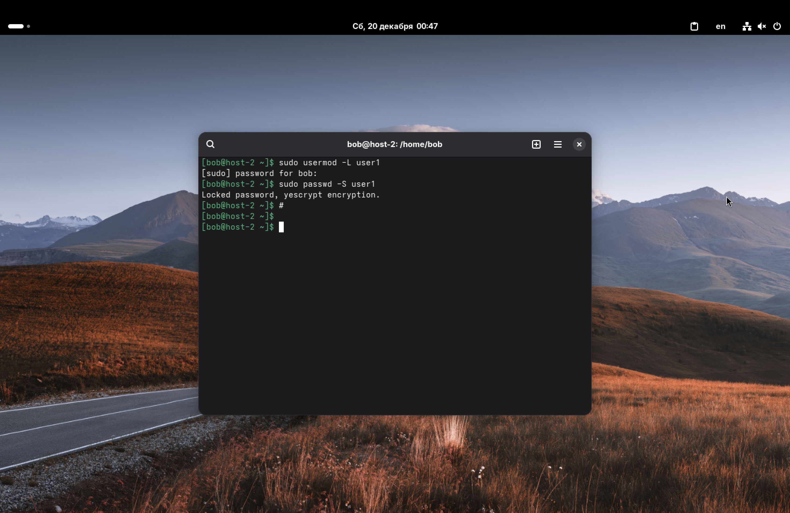

1. Запретите пользователю user1 из предыдущего задания выполнять вход в систему.
2. Как вы это сделали?

Чтобы запретить пользователю user1 вход в систему, пропишем следующую команду: ```sudo usermod -L user1```

Здесь мы снова воспользовались командой ```usermod```. Флаг ```-L``` (Lock) блокирует учетную запись пользователя.

Принцип работы в следующем: в файле ```/etc/shadow``` перед зашифрованным паролем пользователя ставится восклицательный знак. Из-за этого хеш пароля становится недействительным, и при попытке входа проверка пароля всегда будет выдавать ошибку.

Проверить статус аккаунта можно командой ```sudo passwd -S user1```.


*P.S. # и пустая строка были добавлены случайно. Решил их не убирать, чтобы не прописывать команды заново.*

---

3. Какие ещё способы это сделать вы знаете?

Существует несколько способов ограничить доступ пользователю, помимо блокировки пароля через ```usermod -L``` (или аналогичной команды ```passwd -l```):

1. *Смена оболочки на ложную.*
   Можно изменить оболочку входа пользователя на специальную программу-заглушку, которая сразу завершает сеанс или выводит сообщение об ошибке.
   Команда: ```sudo usermod -s /sbin/nologin user1``` (или ```/bin/false```).
   Это способ более действенный, так как он запрещает вход даже если у пользователя настроен доступ по SSH-ключам (блокировка пароля в этом случае не поможет).

2. *Установка даты истечения действия учетной записи.*
   Можно установить дату окончания действия аккаунта в прошлом (напр., 1 января 1970 года).
   Команда: ```sudo usermod -e 1 user1``` (или ```sudo chage -E 0 user1```).
   Флаг ```-e``` (expire) указывает дату, после которой учетная запись отключается.

3. *Ручное редактирование файлов.*
   Можно вручную отредактировать файл ```/etc/passwd``` (изменив оболочку) или ```/etc/shadow``` (поставив ! перед хешем пароля), но этот метод не так предпочтителен из-за риска сделать что-то не так и нарушить работу системы.

---

4. Можно ли создать пользователей с одинаковыми username?

Нет, создать двух пользователей с абсолютно одинаковыми именами обычными методами не получится.

Команда ```useradd``` выдаст ошибку: `useradd: user 'user1' already exists`, т. к. имя пользователя является уникальным идентификатором для системы аутентификации.

Linux различает пользователей по *UID* (User ID), а имя пользователя – это просто удобное представление этого ID.

*Прим.: Технически можно создать разные username с одинаковым UID (это будут разные логины, имеющие права одного и того же пользователя), но одинаковые username система создать не даст, т. к. возникнет конфликт при обращении к домашним каталогам, почте и записям в ```/etc/passwd```.*
