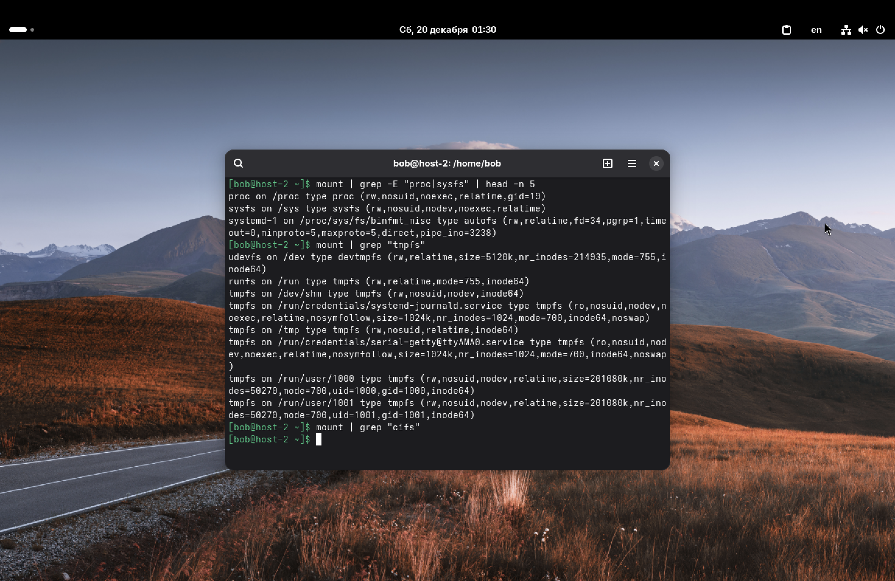
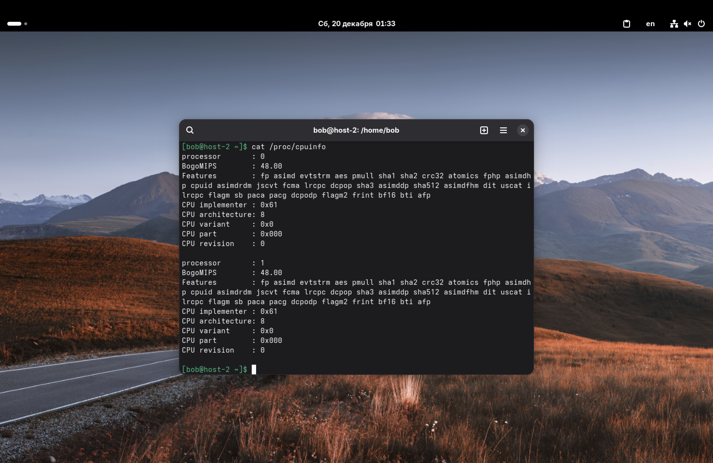
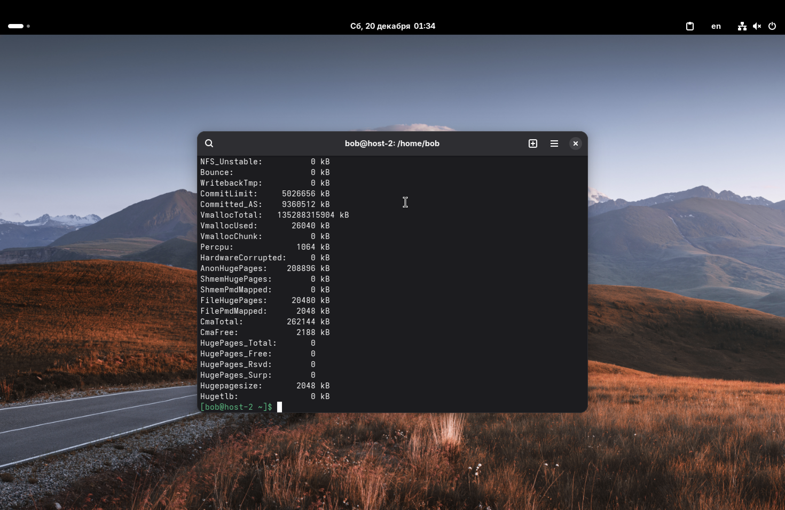

1. Какие файловые системы вы знаете?

Файловых систем существует довольно много, но самые распространенные можно разделить по ОС, где они используются по умолчанию:
*   *Windows:* NTFS, FAT32, exFAT.
*   *Linux:* ext4, XFS, Btrfs, ZFS.
*   *macOS:* APFS, HFS+.
*   *Сетевые:* NFS, SMB (CIFS).

---

2. Как можно классифицировать файловые системы? В чём отличия?

Файловые системы можно разделить по их назначению и принципу работы:
1.  *Дисковые (блочные):* Предназначены для хранения файлов на физических носителях (HDD, SSD). (Примеры: ext4, NTFS).
2.  *Сетевые:* Позволяют получать доступ к файлам на удаленных компьютерах через сеть. (Примеры: NFS, CIFS).
3.  *Виртуальные (псевдофайловые):* Не хранят данные на диске, а предоставляют интерфейс для взаимодействия с ядром системы или оперативной памятью. Существуют только пока работает ОС. (Примеры: procfs, sysfs).
4.  *Специализированные:* Например, для флеш-памяти (F2FS) или для работы только в ОЗУ (tmpfs).

Отличия: поддержка журналирования (для защиты от сбоев), максимальный размер файла и тома, поддержка шифрования, сжатие на лету и снапшоты.

---

3. Какие файловые системы используются в Linux?

Базой для большинства дистрибутивов является *ext4*. На серверах (особенно RHEL/CentOS) часто используется *XFS* из-за хорошей работы с большими файлами. В более современных или особенных конфигурациях применяют *Btrfs* или *ZFS* (поддержка снапшотов, RAID-массивов на уровне ФС). Для системных нужд всегда используются *tmpfs*, *procfs*, *sysfs*.

---

4. Как можно создать файловую систему на диске?

Создание файловой системы в Linux выполняется утилитами семейства `mkfs` (Make FileSystem).

Например, чтобы создать файловую систему ext4 на разделе диска `/dev/sdb1`, нужно выполнить команду:
```sudo mkfs.ext4 /dev/sdb1```

Если бы мы хотели создать файловую систему XFS, команда была бы `sudo mkfs.xfs /dev/sdb1`.

---

5. Как можно подключить диск в систему, что такое монтирование?

Как вы говорили на лекциях (да и это, в целом, общеизвестный факт), в Linux нет дисков C или D. Есть единое дерево каталогов, начинающееся с корня `/`.
*Монтирование* – это процесс подключения файловой системы (на диске, флешке или в сети) к конкретной папке в этом дереве. Эта папка называется "точкой монтирования".

Для подключения используется команда `mount`.
Пример подключения раздела `/dev/sdb1` в папку `/mnt/data`:
```sudo mount /dev/sdb1 /mnt/data```

Чтобы отключить диск, используется команда `umount`.

---

6. Файловая система procfs, cifs, tmpfs, sysfs. В чём особенности каждой из них? Вывести каталоги к которым примонтированы эти файловые системы.

Разберем особенности:
*   *procfs* (Process Filesystem) – виртуальная ФС. Содержит информацию о запущенных процессах и параметрах ядра. Позволяет менять настройки ядра на ходу. Обычно монтируется в `/proc`.
*   *sysfs* – также виртуальная ФС. Предоставляет информацию об оборудовании, драйверах и устройствах, подключенных к системе. Обычно монтируется в `/sys`.
*   *tmpfs* (Temporary Filesystem) – хранит файлы в оперативной памяти (RAM). Работает очень быстро, но данные стираются при перезагрузке.
*   *cifs* (Common Internet File System) – реализация протокола SMB. Используется для подключения сетевых папок Windows/Samba.

Чтобы вывести точки монтирования, воспользуемся командой `mount` с фильтрацией через `grep`.

Ищем procfs и sysfs:
```mount | grep -E "proc|sysfs" | head -n 5```
(использовал `head`, чтобы не захламлять скриншот, так как выводов может быть много).

Ищем tmpfs:
```mount | grep "tmpfs"```

Ищем cifs (если мы не примонтировали сетевую папку прямо сейчас, то вывод будет пуст):
```mount | grep "cifs"```



На скриншоте видно, что:
*   `proc` примонтирована в `/proc`
*   `sysfs` примонтирована в `/sys`
*   `tmpfs` встречается в `/run`, `/dev/shm` и других системных каталогах.

---

7. Как можно получить информацию о системе используя лишь команду cat? Вывести информацию о процессоре и состоянии памяти системы.

Так как `procfs` даёт информацию о системе в виде обычных текстовых файлов, мы можем прочитать их командой `cat`.

Информация о процессоре хранится в файле `/proc/cpuinfo`:
```cat /proc/cpuinfo```



Информация о памяти хранится в файле `/proc/meminfo`:
```cat /proc/meminfo```


