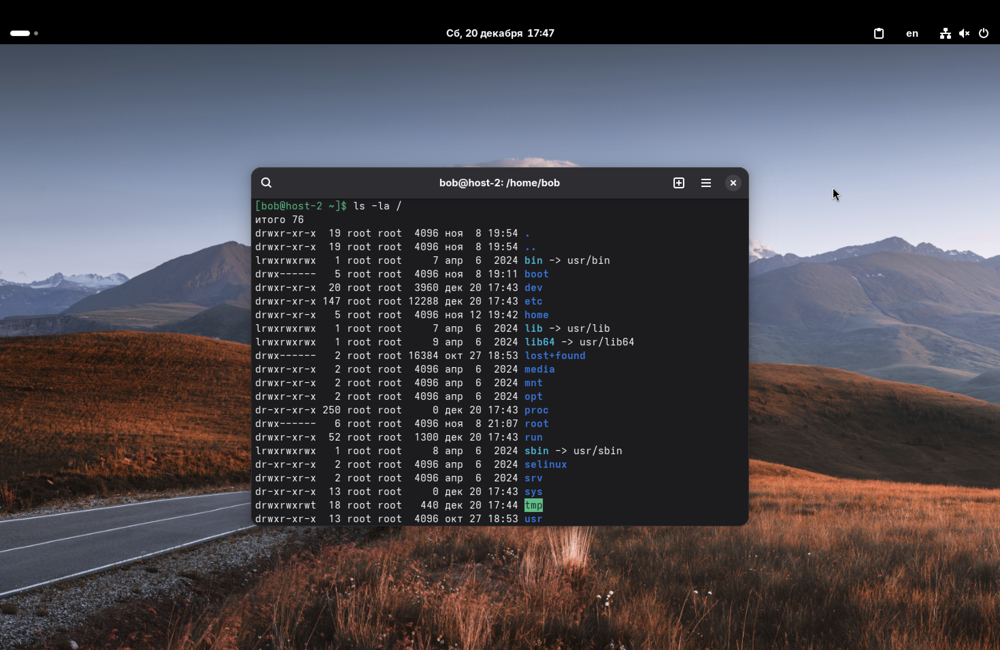
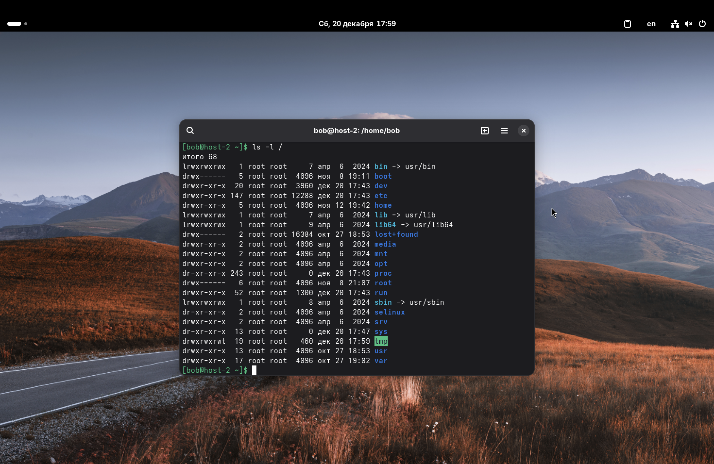

1. Какая структура каталогов в Linux? Выведите список файлов в корне системы.

В Linux реализована иерархическая древовидная структура каталогов. В отличие от Винды, здесь нет привычных для кого-то "дисков", а есть единый корень – **`/`**, к которому монтируются все остальные разделы и устройства.

Эта структура стандартизирована документом FHS, чтобы в разных дистрибутивах всё лежало на привычных местах.

Чтобы посмотреть содержимое корня, выполним команду:
```ls -la /```



---

2. Где хранятся папки пользователей в системе?

Домашние директории обычных пользователей по умолчанию хранятся в каталоге ```/home```.
Например, для пользователя bob (с которого я работаю) путь выглядит как `/home/bob` (сокр. `~`).

---

3. Где домашняя папка суперпользователя?

Домашняя папка суперпользователя (root) находится отдельно от остальных – в директории `/root`.

Так устроена для безопасности и стабильности. Каталог `/home` часто располагают на отдельном диске или разделе. Если этот диск не примонтируется или сломается, рут всё равно должен иметь доступ к своему профилю и конфигам, чтобы починить систему, поэтому его папка лежит на том же разделе, что и корень системы.

---

4. Где хранятся основные конфигурационные файлы в системе?

Общесистемные настройки хранятся в каталоге `/etc`.

Мы уже встречались (и встретимся) с этим каталогом в заданиях:
*   `/etc/passwd` – список пользователей.
*   `/etc/ssh/sshd_config` – настройки SSH.
*   `/etc/samba/smb.conf` – настройки Samba.

---

5. Что за папки /bin, /sbin, /usr/bin, /usr/sbin?

Эти каталоги предназначены для хранения исполняемых файлов (программ и утилит). Разница между ними заключается в важности программ и правах доступа.

*   `/bin` (Binaries) – содержит основные команды, необходимые для работы системы и восстановления (например: `ls`, `cp`, `cat`, `bash`). Они доступны всем пользователям.
*   `/sbin` (System Binaries) – содержит утилиты для администрирования системы, настройки сети и загрузки (например: `fdisk`, `reboot`, `iptables`). Обычный пользователь может их видеть, но запустить чаще всего может только рут.
*   `/usr/bin` – содержит прикладные программы для пользователей, которые не критичны для загрузки системы (браузеры, утилиты, компиляторы).
*   `/usr/sbin` – системные службы и демоны, которые не требуются на раннем этапе загрузки (например, тот же `sshd` или `smbd`).

*Прим.: В современных дистрибутивах часто используется объединение каталогов, где `/bin` и `/sbin` являются просто ссылками на `/usr/bin` и `/usr/sbin` соответственно. Проверим это через команду `ls -l /`.*


