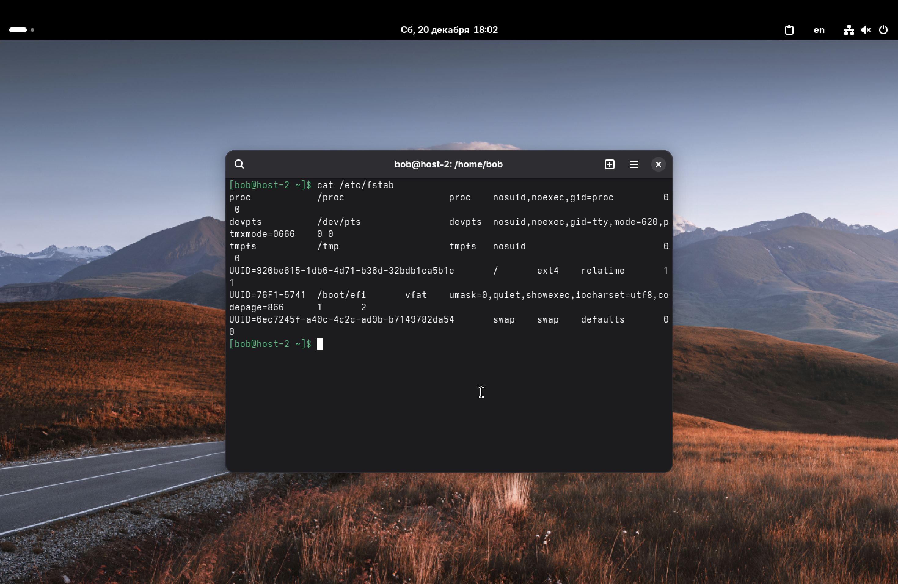
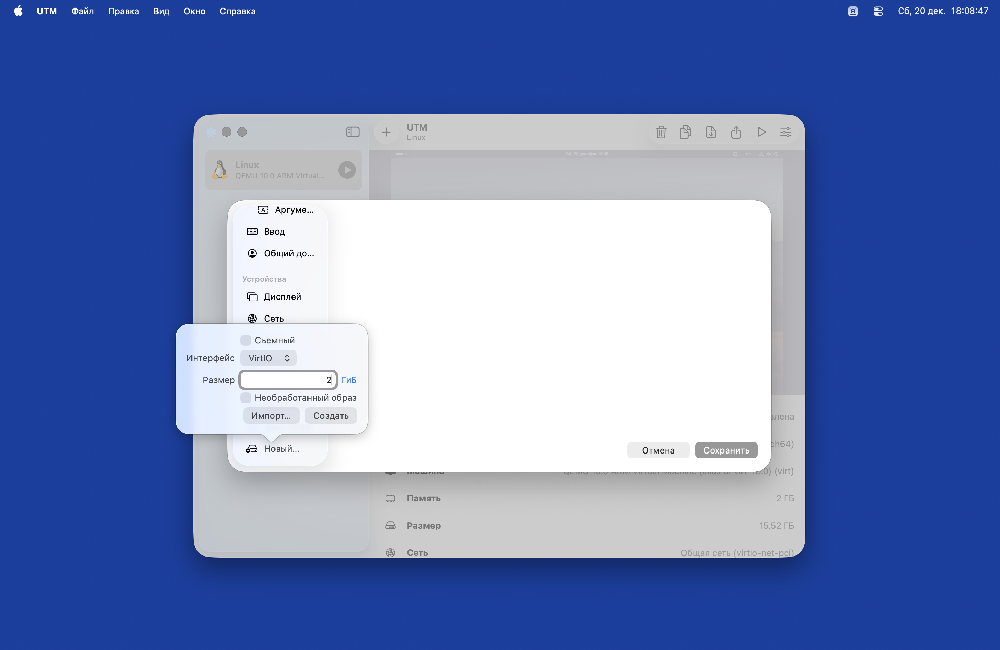
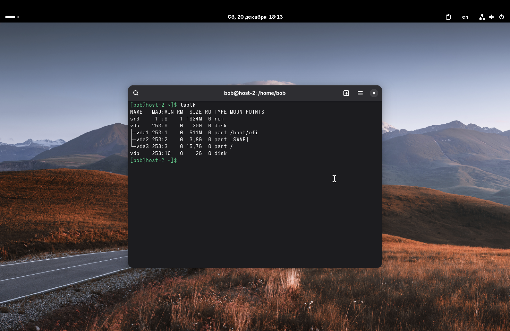
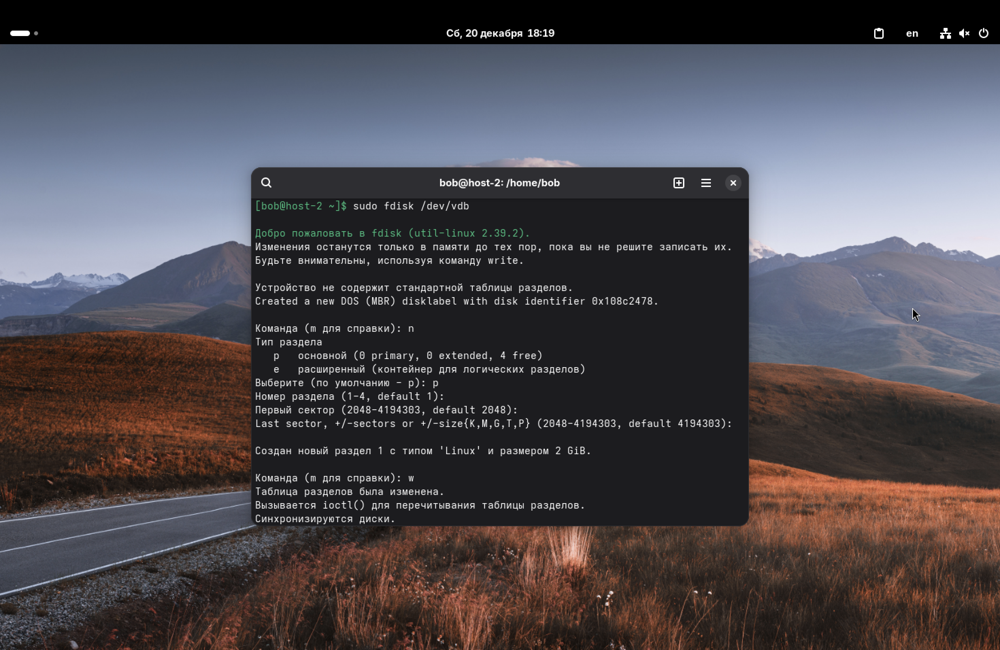
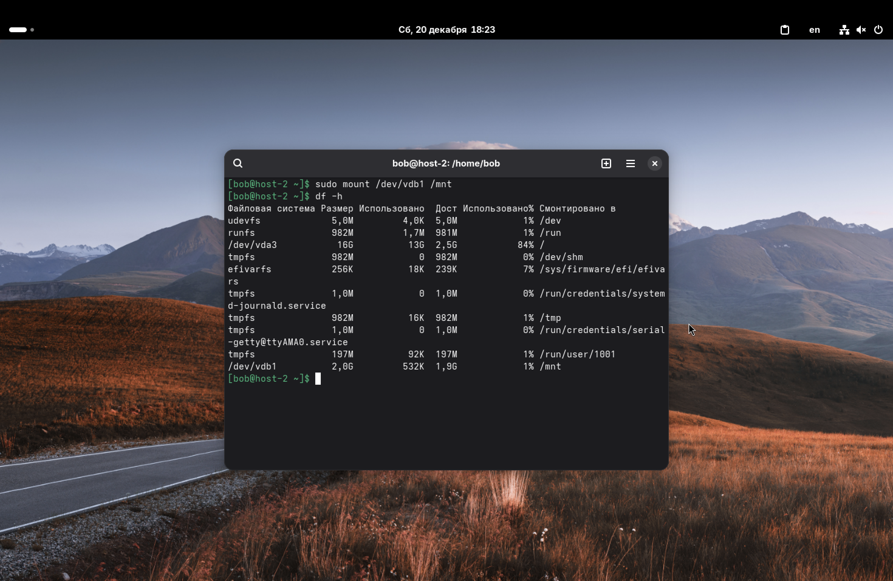
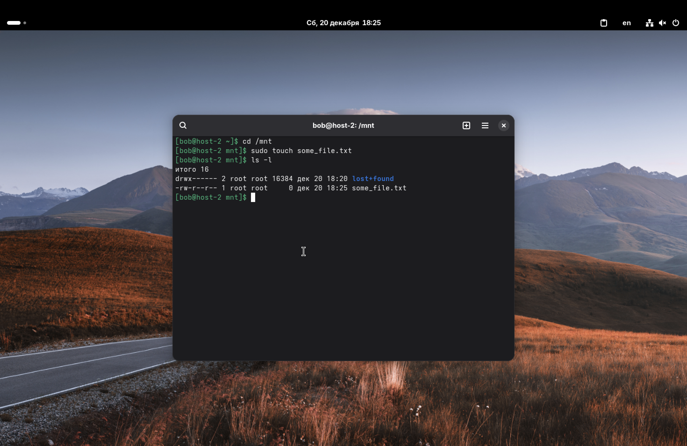
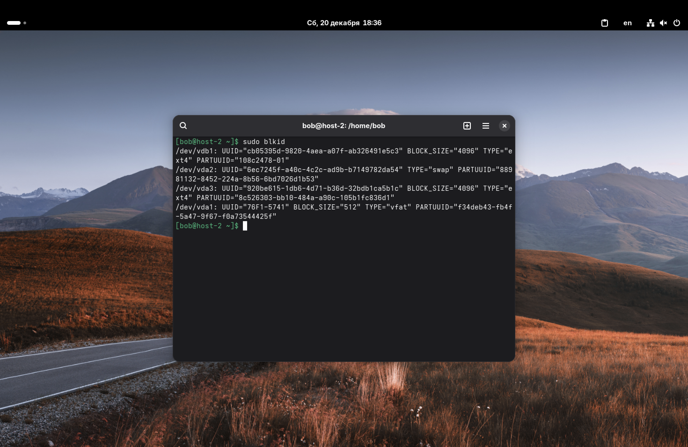
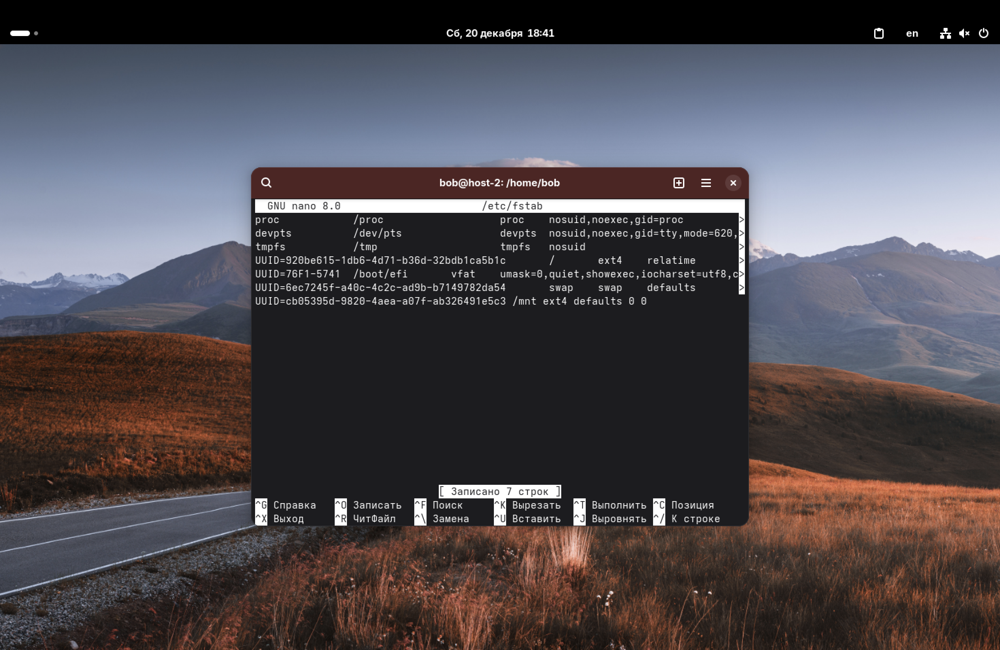
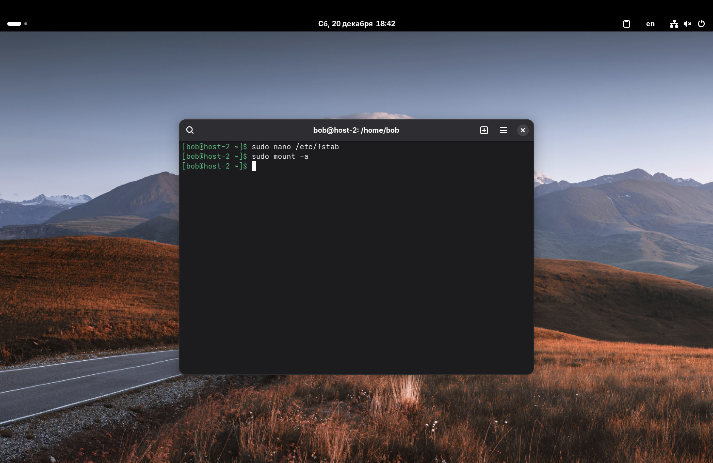

1. Выведите содержимое fstab. Что хранится в fstab?

Выведем содержимое файла через `cat`:
```cat /etc/fstab```

Файл `/etc/fstab` содержит информацию о ФС и устройствах хранения (жестких дисках, разделах, сетевых хранилищах), которые должны быть автоматически смонтированы при загрузке ОС.
Каждая строка описывает одно устройство: что монтировать, куда монтировать, тип ФС и параметры монтирования.



---

2. Добавьте в виртуальную машину ещё один диск.

Заходим в настройки виртуальной машины (UTM в моем случае), выбираем пункты "Диски" -> "Новый" и добавляем новый виртуальный жесткий диск размером 2 ГБ.



---

3. Узнайте как система видит ваш диск – выведите информацию о блочных устройствах.

Для вывода списка блочных устройств используем команду `lsblk`.

Видно, что помимо основного диска `vda` (на котором стоит система), появилось новое устройство `vdb` размером 2 ГБ. У него пока нет разделов (ветви `vdb1, vdb2 ...` отсутствуют).



---

4. С помощью полученной информации создайте на диске таблицу разделов и файловую систему ext4.

Сначала создадим раздел. Для этого воспользуемся утилитой `fdisk` (и пропишем команду ниже): 
`sudo fdisk /dev/vdb`

Внутри интерактивного режима были проделаны следующие действия:
1.  *n* – создали новый раздел.
2.  *p* – выбрали основной тип (primary).
3.  *Enter* (3 раза) – согласились со значениями по умолчанию (номер раздела 1, использовать всё пространство диска).
4.  *w* – записать изменения на диск и выйти.



Теперь, когда у нас появился раздел `/dev/vdb1`, создадим на нём файловую систему *ext4*:
```sudo mkfs.ext4 /dev/vdb1```


---

5. Примонтируйте диск в каталог /mnt.

Используем команду `mount`. Т. к. мы монтируем раздел, а не сам диск, указываем `vdb1`:
```sudo mount /dev/vdb1 /mnt```

Проверим через `df -h` или `lsblk`.



---

6. Зайдите в каталог и создайте там файлы.

Для краткости, все команды на скриншоте:



---

7. Отмонтируйте диск и проверьте остались ли файлы.

Сначала нужно выйти из директории `/mnt` (иначе получим ошибку "target is busy"):
```cd ~```

Теперь отмонтируем:
```sudo umount /mnt```

Проверяем содержимое папки `/mnt`:
```ls -l /mnt```

Папка пуста. Это логично: файл `some_file.txt` лежит на нашем новом диске `vdb`. Мы отключили диск от папки `/mnt`, поэтому файл перестал быть виден, но он не удалился.


---

8. Сделайте так чтобы диск автоматически подключался при загрузке системы (добавьте информацию о нём в fstab).

Чтобы запись была более надежной, лучше использовать UUID диска, а не имя `/dev/vdb1` (т. к. имена могут меняться).

Узнаем UUID командой: ```sudo blkid```



Копируем значение UUID для `/dev/vdb1`:
1. Открываем файл fstab: ```sudo nano /etc/fstab``` 
2. Добавляем в конец строку: 
```UUID=(здесь UUID раздела vdb1) /mnt ext4 defaults 0 0```



---

9. Проверьте корректность записанных в fstab данных перед перезагрузкой.

Это очень важный шаг. Понятно, что если ошибиться в fstab, система может не загрузиться. Пропишем следующую команду: ```sudo mount -a```

Эта команда пытается прочитать fstab и примонтировать всё, что там указано. Если она выполнилась молча (без вывода ошибок), значит синтаксис верный.



---

10. Перезагрузите систему и убедитесь что диск был подключён к системе.

Перезагрузим: ```sudo reboot```
После входа в систему снова выполняем `df -h` или `lsblk`.
Видим, что раздел `vdb1` автоматически примонтирован в `/mnt`.


