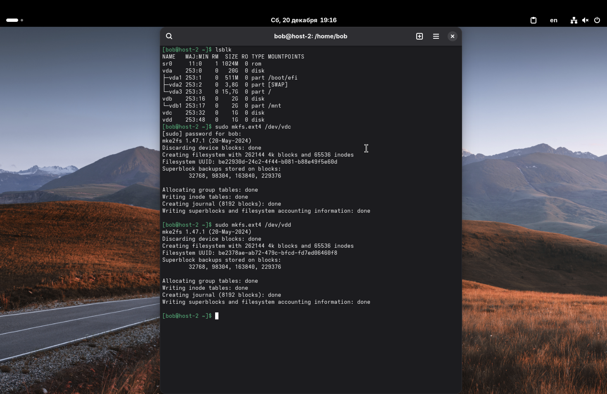
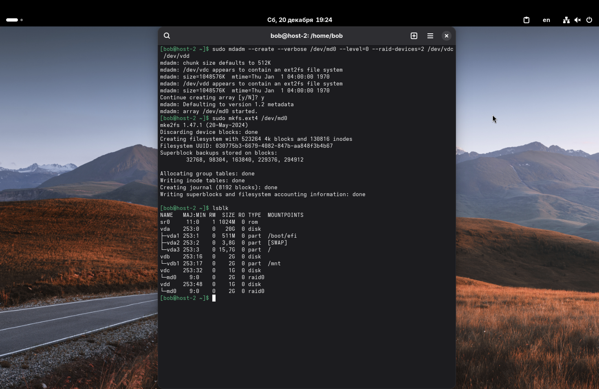
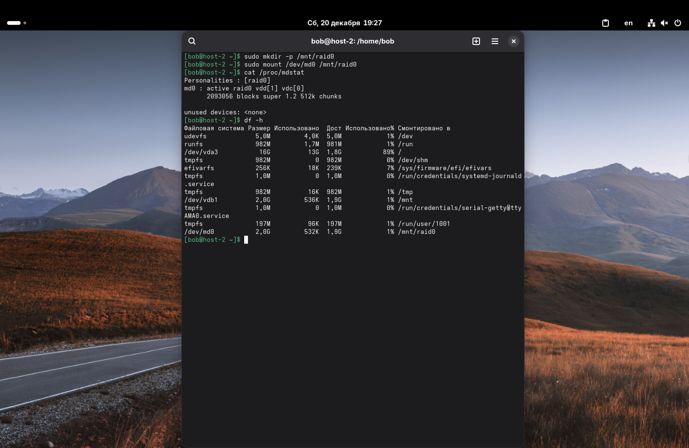
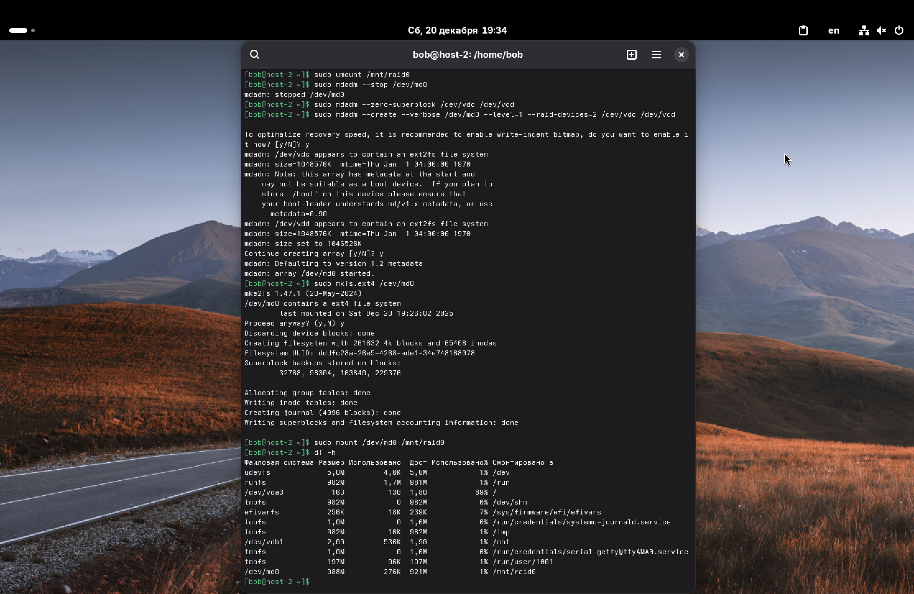

1. RAID массивы, что такое и какие бывают?

*RAID (Redundant Array of Independent Disks)* – это технология виртуализации данных, которая объединяет несколько физических дисков в один логический элемент для повышения производительности и/или надежности хранения данных.

Основные типы:
*  *RAID 0:* Данные разбиваются на блоки и записываются поочередно на все диски.
    *   *Плюсы:* Максимальная скорость и объем (сумма всех дисков).
    *   *Минусы:* Нет надежности. Сгорает один диск – теряются все данные массива.
*  *RAID 1:* Данные дублируются (зеркалируются) на два диска.
    *   *Плюсы:* Высокая надежность. Если один диск сгорит, система продолжит работать.
    *   *Минусы:* Полезный объем равен объему одного диска (второй – копия).
*  *RAID 5:* Использует чередование с контролем четности. Нужно минимум 3 диска. Выдерживает отказ одного диска.
*  *RAID 10 (1+0):* Комбинация скорости (0) и надежности (1). Нужно минимум 4 диска.

---

2. Добавьте в виртуальную машину 2 диска, отформатируйте их в ext4.
3. Создайте из них raid 0 массив.

Добавили в настройках UTM два новых диска (как в task3) по 1 ГБ каждый (`vdc` и `vdd`).
Для работы с RAID в Linux нужна утилита `mdadm`. Установим её:
```sudo apt-get install mdadm -y```

*Прим.: Если отформатировать диски в ext4 до создания RAID-массива, то после создания RAID-массива эти ext4 были бы уничтожены. Чтобы избежать этого, можно сначала собрать RAID из этих двух дисков и после отформатировать его в ext4. Но никто не мешает нам сначала отформатировать диски в ext4, создать из них RAID и потом отформатировать RAID в ext4 (то есть действовать по заданию). Так и сделаем.*

Отформатируем наши диски в ext4:
`sudo mkfs.ext4 /dev/vdc`
`sudo mkfs.ext4 /dev/vdd`



Собираем RAID 0 из них:
```sudo mdadm --create --verbose /dev/md0 --level=0 --raid-devices=2 /dev/vdc /dev/vdd```

Здесь:
*   `/dev/md0` — имя нашего нового RAID-устройства.
*   `--level=0` — уровень RAID 0.
*   `--raid-devices=2` — количество дисков.

Теперь, когда устройство `/dev/md0` создано, создадим на нём файловую систему ext4:
```sudo mkfs.ext4 /dev/md0```



---

4. Проверьте всё ли работает.

Создём точку монтирования и монтируем наш массив:
```sudo mkdir -p /mnt/raid0```
```sudo mount /dev/md0 /mnt/raid0```

Проверим статус RAID'а командой:
```cat /proc/mdstat```
(Видно, что активен raid0, участвуют vdc и vdd).

Проверим объем командой `df -h`:
Мы объединили два диска по 1 ГБ в RAID 0, поэтому общий объем должен быть 2 ГБ. На скриншоте видно, что `/dev/md0` имеет размер 1.9G – всё верно.



---

5. Удалите raid0 и создайте raid1.

Сначала нужно корректно разобрать старый массив:
1.  Отмонтируем: ```sudo umount /mnt/raid0```
2.  Останавливаем массив: ```sudo mdadm --stop /dev/md0```
3.  Стираем метаданные RAID с дисков, иначе система будет пытаться собрать старый массив снова: ```sudo mdadm --zero-superblock /dev/vdc /dev/vdd```

Теперь создаем *RAID 1*:
```sudo mdadm --create --verbose /dev/md0 --level=1 --raid-devices=2 /dev/vdc /dev/vdd```

Снова создаем файловую систему на массиве (т. к. старая удалилась вместе с RAID 0):
```sudo mkfs.ext4 /dev/md0```

Снова монтируем и проверяем:
```sudo mount /dev/md0 /mnt/raid0``` (смонтировали в старую папку raid 0 просто для удобства)
```df -h```

Теперь видно, что объем `/dev/md0` стал ~ 1 ГБ (хотя дисков два). Всё потому, что в RAID 1 второй диск является полной копией первого.



---

6. В чём между ними разница?

Разница в назначении:
*   *RAID 0* стоит использовать там, где нужна максимальная скорость чтения/записи или большой единый объем, и где потеря данных не критична (например, для кэша).
*   *RAID 1* можно использовать для важных данных. Если физически сломается диск `vdc`, то данные останутся целы на `vdd` (пример). Но плата за это – потеря половины объема.

---

7. Есть ли файловые системы которые поддерживают raid массивы без стороннего ПО?

Да, существуют современные файловые системы *CoW* (Copy on Write), которые имеют встроенный менеджер томов и умеют сами собирать RAID без использования `mdadm` или аппаратных контроллеров.
Самые известные примеры:
*   *ZFS* (Zettabyte File System) – мощная ФС, использующая свои принципы RAID-Z.
*   *Btrfs* (B-tree FS) – базовая для многих Linux дистрибутивов, поддерживает raid0, raid1, raid10 "из коробки".

---

8. Можно ли создать raid массив во время установки системы?

Да, практически все современные установщики Linux (Debian Installer, Anaconda в Fedora/CentOS, Subiquity в Ubuntu Server) позволяют разметить диски вручную на этапе установки. В них можно выбрать несколько дисков, пометить их как "Linux RAID" и собрать из них массив `/dev/md0`, на который уже будет установлена сама система.
