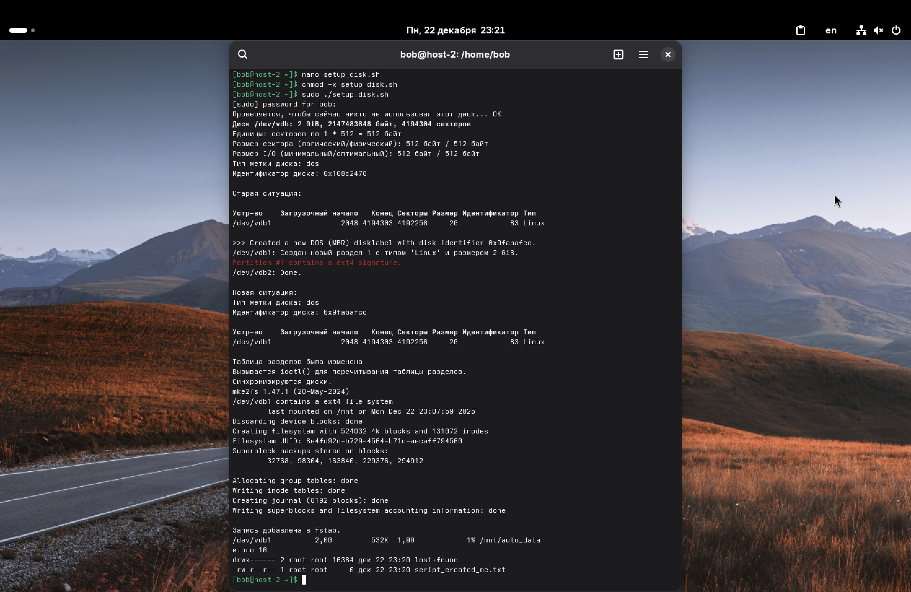

1. Что такое шебанг?

*Шебанг (Shebang)* – это последовательность из двух символов `#!` в самом начале файла скрипта.

После этих символов указывается полный путь к интерпретатору, который должен выполнить команды из этого файла.
Примеры:
*   `#!/bin/bash` – скрипт будет выполнен оболочкой Bash.
*   `#!/usr/bin/python3` – скрипт будет выполнен интерпретатором Python.

Когда мы запускаем файл как программу (например, `./script.sh`), загрузчик ядра смотрит на первую строку. Если там есть шебанг, он запускает указанный интерпретатор и передает ему путь к скрипту как аргумент.

2. Обязательно ли исполняемый файл должен иметь соответствующее расширение?

Нет, в Linux расширение файла (например, `.sh` или `.py`) не является обязательным. Операционная система определяет тип файла по его содержимому (магическим числам/заголовкам) и правам доступа.

Чтобы файл стал исполняемым, ему нужно выдать соответствующее право:
`chmod +x my_script`

Расширения используются в основном для удобства пользователя (чтобы сразу понимать, что внутри) и для подсветки синтаксиса в редакторах кода.

3. Напишите скрипт, который выполнит автоматически действия из блока работы с файлами.

Был написан скрипт, который автоматизирует процесс из task3, Lab3: создание раздела, форматирование в ext4, создание точки монтирования, монтирование и запись в fstab.

Но для начала, разберем флаги `set -euo pipefail`, которые были добавлены в начало скрипта для удобства (и по вашей рекомендации):

*   `set -e`: Если какая-либо команда вернет код ошибки (не ноль), скрипт немедленно остановится. Это позволяет исключить случай, когда, условно, одна команда сработала некорректно, а скрипт продолжает действовать дальше, постепенно все ломая.
*   `set -u`: Если скрипт попытается использовать переменную, которая не была задана, он завершится с ошибкой. Это помогает ловить опечатки в названиях переменных.
*   `set -o pipefail`: Если в пайплайне, например `command1 | command2`, упадет `command1`, то весь пайплайн вернет ошибку. По умолчанию, Bash возвращает код возврата только последней команды (то есть, если `command1` сломалась, а `command2` отработала успешно, скрипт подумает, что всё хорошо).

*Код скрипта:*

```
#!/bin/bash
set -euo pipefail

# Своего рода "константы" для удобной работы
DISK="/dev/vdb"
PARTITION="${DISK}1"
MOUNT_POINT="/mnt/auto_data"

if [[ $EUID -ne 0 ]]; then
   echo "Чтобы запустить этот скрипт, у вас должны быть права суперпользователя."
   exit 1
fi

# Пытаемся размонтировать раздел, если он смонтирован
umount "$PARTITION" 2>/dev/null || true
umount "$MOUNT_POINT" 2>/dev/null || true

# Пытаемся найти массивы, связанные с этим диском, и остановить их
if lsblk "$DISK" | grep -q "md"; then
   mdadm --stop --scan || true
   mdadm --zero-superblock "$DISK" || true 
fi

# Отключаем swap, в случае наличия
swapoff "$DISK" 2>/dev/null || true
swapoff "$PARTITION" 2>/dev/null || true

# Очищаем подписи (на случай, если диск был частью чего-то)
wipefs -a "$DISK"

# Создаем таблицу разделов и новый раздел
echo ",,L" | sfdisk "$DISK"

# Заставляем ядро перечитать таблицу разделов (с паузой)
partprobe "$DISK" || true
sleep 2

# Форматируем раздел в ext4
mkfs.ext4 -F "$PARTITION"

# Создаем точку монтирования
mkdir -p "$MOUNT_POINT"

# Монтируем
mount "$PARTITION" "$MOUNT_POINT"

# Создаем тестовый файл
touch "$MOUNT_POINT/script_created_me.txt"

# Добавляем запись в fstab для автозагрузки (Получаем UUID раздела)
UUID=$(blkid -s UUID -o value "$PARTITION")

if [ -z "$UUID" ]; then 
   echo "Не удалось получить UUID раздела." 
   exit 1 
fi

# Удаляем старые записи об этом UUID или точке монтирования
sed -i "\|$MOUNT_POINT|d" /etc/fstab
sed -i "\|$UUID|d" /etc/fstab

# Проверяем, нет ли уже такой записи в fstab
if grep -q "$UUID" /etc/fstab; then
   echo "Такой UUID уже есть в fstab."
else
   echo "UUID=$UUID $MOUNT_POINT ext4 defaults,nofail,x-systemd.device-timeout=5 0 2" >> /etc/fstab
   echo "Запись добавлена в fstab."
fi

df -h | grep "$MOUNT_POINT"
ls -l "$MOUNT_POINT"
```

Чтобы всё это дело запустить, сохраним данный код в файл `setup_disk.sh`, дадим ему права на выполнение и запустим через sudo:

```
chmod +x setup_disk.sh
sudo ./setup_disk.sh
```


