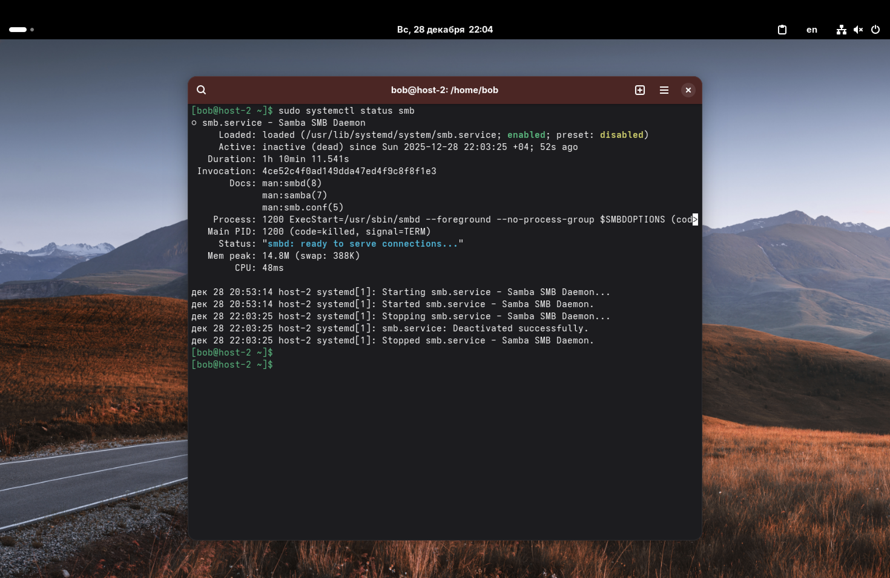
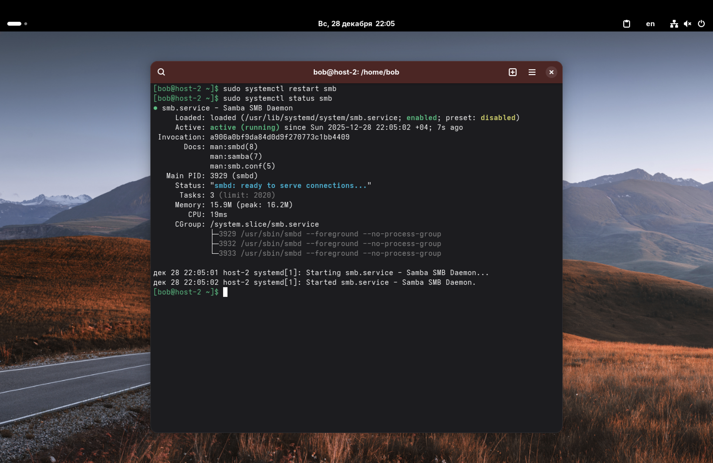
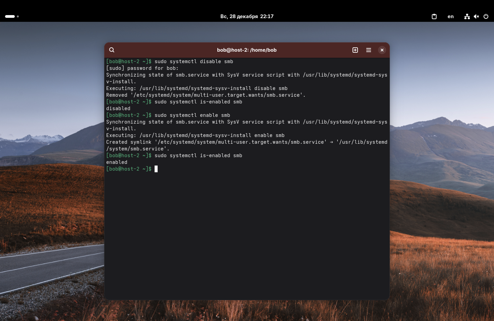

1. Что такое systemd юнит?

*Systemd юнит* – это файл конфигурации, который описывает, как система инициализации (systemd) должна управлять ресурсом. Это может быть служба, точка монтирования, устройство или таймер.

Основные типы юнитов:
*   `.service` – службы и сервисы;
*   `.mount` – точки монтирования файловых систем;
*   `.timer` – таймеры;
*   `.target` – группы юнитов.

Системные юниты хранятся в `/usr/lib/systemd/system/`, а пользовательские настройки –в `/etc/systemd/system/`.

---

2. Проверьте статус любого systemd юнита, какую информацию выводит эта команда?

Проверим статус службы Samba: `sudo systemctl status smb`

Команда выводит: загружен ли юнит (Loaded), его текущее состояние (Active: active/inactive (running/dead)), ссылку на документацию, PID основного процесса, использование памяти и логи для этой службы.

---

3. Попробуйте остановить сервис.
4. Перезапустите его.

Остановим службу и проверим статус (она должна стать inactive):
`sudo systemctl stop smd`
`sudo systemctl status smb`

Перезапустим службу (она снова станет active, параметр Active станет active (running), PID изменится): `sudo systemctl restart smb`

---

5. Удалите из автозагрузки.
6. Верните обратно.

Чтобы служба не запускалась при старте системы: `sudo systemctl disable smb`
Проверить это можно командой: `sudo systemctl is-enabled smb`

Вернем её в автозагрузку: `sudo systemctl enable smb`
Снова проверим: `enabled`

---

7. Что такое таймеры?

*Таймеры* – это специальные systemd юниты (с расширением `.timer`), которые используются для планирования запуска других юнитов по времени или событию. Это современная и более мощная альтернатива классическому `cron`.
