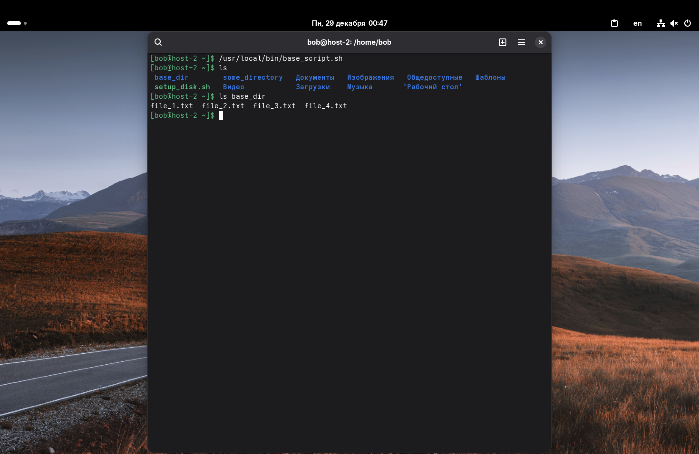
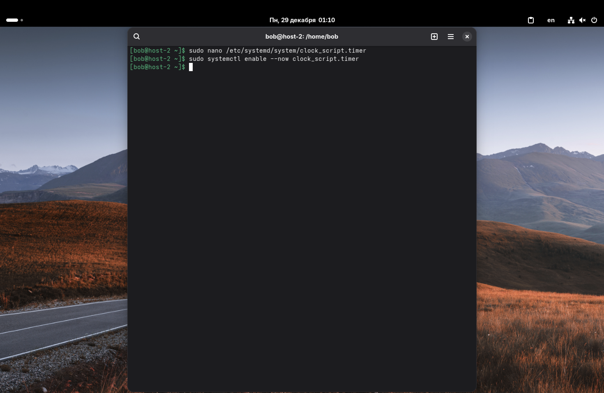
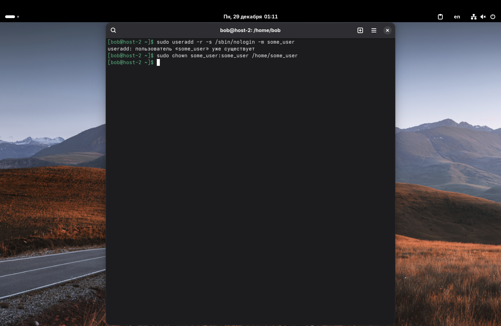
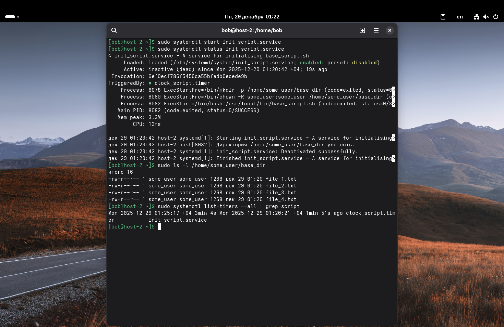

1. Создайте скрипт который создаёт папку заполняет её файлами ( имена 1-4 ) и записывает в них информацию о текущей дате, версии ядра, имени компьютера и списе всех файлов в домашнем каталоге пользователя от которого выполняется скрипт( не забудьте сдлеать проверку на существование файлов и папок)

Создали скрипт `/usr/local/bin/base_script.sh`, который создает директорию, заполняет её файлами с системной информацией (выполняет исходное задание).

Сам скрипт:
```
#!/bin/bash

# На всякий случай переходим в домашнюю директорию
cd ~

# Константа для искомого пути
BASE_DIR="$HOME/base_dir"

# Проверка и создание директории
if [ -d "$BASE_DIR" ]; then
    echo "Директория $BASE_DIR уже есть."
else
    mkdir -p "$BASE_DIR"
fi

# Создание файлов 1-4
for i in {1..4}; do
    FILE_PATH="$BASE_DIR/file_$i.txt"
    
    if [ -f "$FILE_PATH" ]; then
        echo "$FILE_PATH уже существует. Придётся перезаписать."
    fi
    
    # Запись информации
    {
        echo "Файл file_$i.txt содержит следующую информацию:"
        echo "Дата: $(date)"
        echo "Ядро: $(uname -r)"
        echo "Хост: $(hostname)"
        echo "Пользователь: $(whoami)"
        echo "--- Файлы в домашнем каталоге ---"
        ls -la ~/ | head -20
        echo "--- Пути ---"
        echo "HOME: $HOME"
        echo "PWD: $(pwd)"
    } > "$FILE_PATH"
done

```

Не забываем дать права на выполнение: `sudo chmod +x /usr/local/bin/base_script.sh`.



---

2. Создайте юнит, который будет вызывать этот скрипт при запуске. Проверьте.

Создадим следующий файл (юнит) `/etc/systemd/system/init_script.service`:

```
[Unit]
Description=A service for initialising base_script.sh
After=network.target multi-user.target

[Service]
# Скрипт будет выполняться от имени спец. пользователя (создадим его позже)
User=some_user
Group=some_user
WorkingDirectory=~

Type=oneshot
ExecStart=/bin/bash /usr/local/bin/base_script.sh
StandardOutput=journal
StandardError=journal

# Подготовка директорий (выполняется от root перед стартом основного процесса)
ExecStartPre=/bin/mkdir -p /home/some_user/base_dir
ExecStartPre=/bin/chown -R some_user:some_user /home/some_user/base_dir

[Install]
WantedBy=multi-user.target
```

Проверим, существует ли вообще данный юнит: `sudo systemctl status init_script.service`


---

3. Создайте таймер, который будет вызывать выполнение одноимённого systemd юнита каждые 5 минут.

Создадим файл `/etc/systemd/system/clock_script.timer`:

```
[Unit]
Description=Starts init_script.service every 5 minutes.
Requires=init_script.service

[Timer]
# Запуск каждые 5 минут
OnCalendar=*:0/5
Unit=script.service

# Задержка для снижения нагрузки
RandomizedDelaySec=30
Persistent=true

[Install]
WantedBy=timers.target
```

Теперь включим таймер:
```sudo systemctl enable --now clock_script.timer```



---

4. От какого пользователя вызываются юниты по умолчанию?

Если параметр `User` не указан, юниты выполняются от имени рута.

---

5. Создайте пользователя, от имени которого будет выполняться ваш скрипт.

Создадим системного пользователя `some_user` без права входа в консоль:
`sudo useradd -r -s /sbin/nologin -m some_user`

Убедимся, что права на домашнюю папку верны:
`sudo chown script_user:some_user /home/some_user`



---

6. Дополните юнит информацией о пользователе, от которого должен выполняться скрипт.

В п. 2 мы уже прописали это в разделе `[Service]`:
```
User=script_user
Group=script_user
```

Это указывает службе, что запускаться нужно именно от этого пользователя.

---

7. Дополните ваш скрипт так, чтобы он независимо от местоположения всегда выполнялся в домашней папке того, кто его вызывает.

Это реализовано двумя способами:
1.  В первой строке скрипта стоит `cd ~`, что переносит выполнение в домашнюю папку текущего пользователя.
2.  Также, в юните прописано `WorkingDirectory=~`, что говорит systemd сделать рабочей директорией домашнюю папку пользователя `some_user`.

---

Проверим теперь всё:



