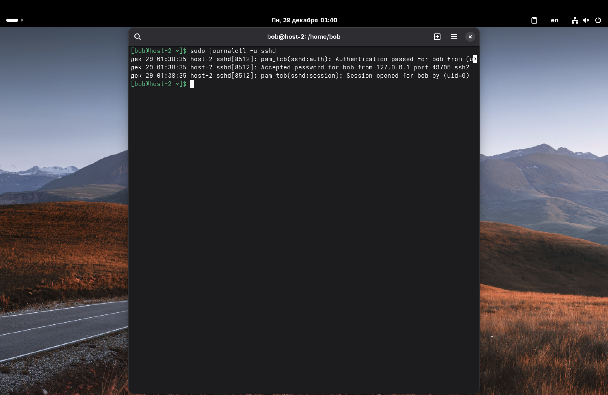
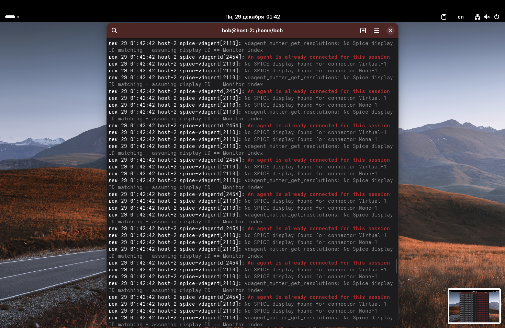
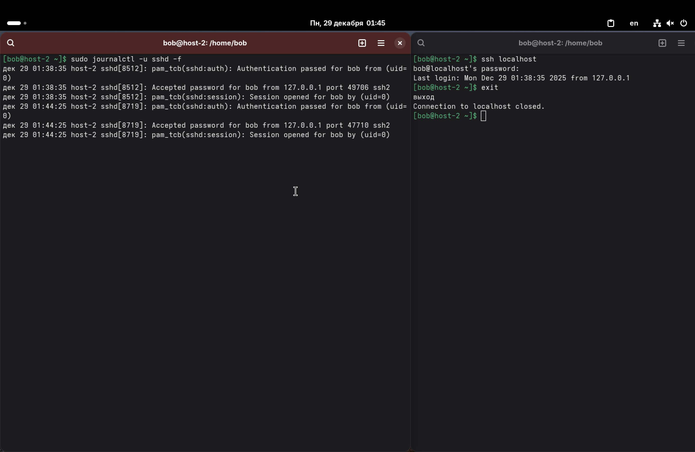

1. Посмотрите журналы ssh.

Для просмотра логов конкретной службы (в нашем случае – ssh) используем утилиту `journalctl` вместе с флагом `-u`: `sudo journalctl -u sshd`

Также, можно удобно фильтровать информацию из журналов:
*   `--since today` – за сегодня.
*   `-p err` – только ошибки.
*   `-n 50` – последние 50 строк.


*P.S. Введя эту команду в первый раз, мне выдало: --No entries--. Причина крылась в том, что служба ssh просто не использовалась на этот момент. Для того, чтобы хоть какие-то логи появились, я подключился по ssh к пользователю bob из другого окна терминала.*

---

2. Выведите журналы в реальном времени.
Для этого, используем флаг `-f`: `sudo journalctl -f`



---

3. Выведите лог в реальном времени для службы sshd.

Комбинируем флаги:
```sudo journalctl -u sshd -f```



---

4. Можно ли без команды journalctl прочитать логи systemd?

Напрямую прочитать файлы логов systemd (`/var/log/journal/`) текстовым редактором нельзя, т. к. `journald` записывает их в бинарном формате для оптимизации и индексации.
Но всё-таки, можно использовать библиотеки systemd для языков программирования или экспортировать логи в текст.

---

5. Сколько будет 2-2?


