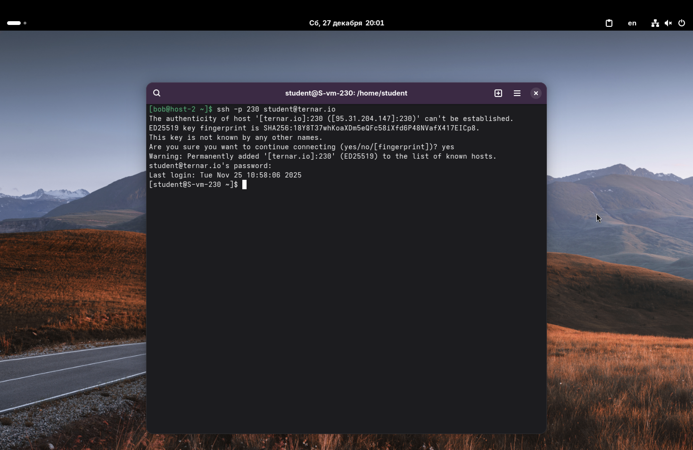
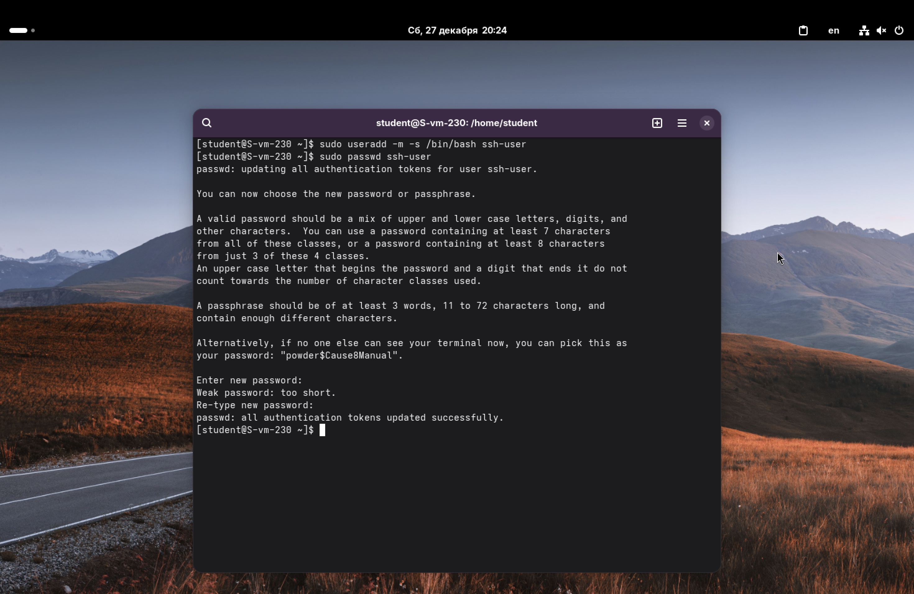
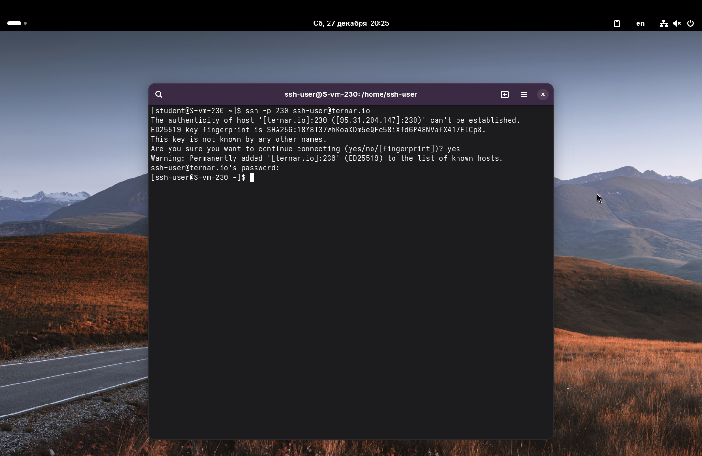
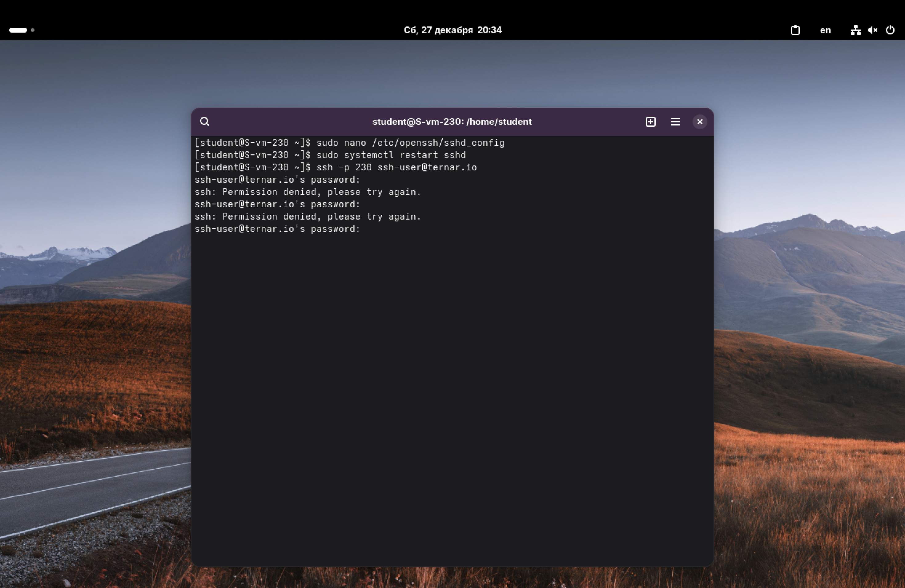

1. Какой по умолчанию используется порт для подключения?
2. Можно ли его изменить? Если да, то как?
3. Какая служба отвечает за обработку запросов на подключения по ssh?
4. Какой файл конфигурации отвечает за его настройку?

По умолчанию протокол SSH использует *22-й порт*.

Да, порт можно изменить. Это часто делается для безопасности, чтобы уменьшить количество брутфорсных атак на стандартный порт. Для этого нужно отредактировать файл конфигурации SSH-сервера и изменить значение `Port 22` на любой другой свободный порт. После изменения необходимо перезапустить службу SSH.

За обработку запросов и обеспечение работы сервера отвечает демон *sshd* (OpenSSH Daemon).

Основной файл конфигурации сервера находится по пути `/etc/openssh/sshd_config`.

---

5. Попробуйте подключиться по ssh к предоставленному вам серверу.

Мой порядковый номер на Ипсилоне – 30, порты начинаются с 201, следовательно, мне нужно подключиться к порту 230.

Подключаемся:
`ssh -p 230 student@ternar.io`

Здесь, `-p` – это флаг, который позволяет указывать порт не по умолчанию.

---

6. Отредактируйте файл настроек на сервере так, чтобы была возможность подключиться к серверу используя пользователя root.

Откроем конфигурационный файл :
`sudo nano /etc/openssh/sshd_config`

*nano на сервере по умолчанию не предусмотрен, поэтому для начала установим его:
`sudo apt-get update`
`sudo apt-get install nano`*

Находим строчку `#PermitRootLogin without-password`. Раскомментируем её и изменим `without-password` на `yes`. Это позволит подключаться к серверу из-под рута.

---

7. Измените количество ошибок ввода пароля перед сбросом соединения, покажите эти изменения.

Найдём параметр `MaxAuthTries` в том же файле `/etc/openssh/sshd_config`. Изменим его, например, на 3: `MaxAuthTries 3`

После внесения всех изменений сохраняем файл и перезапускаем службу sshd, чтобы настройки вступили в силу: `sudo systemctl restart sshd`.

Продемонстрируем изменения: `sudo grep "MaxAuthTries" /etc/ssh/sshd_config`

---

8. Создайте пользователя ssh-user и попробуйте им подключиться к серверу.

Создадим пользователя и зададим ему пароль:
`sudo useradd -m -s /bin/bash ssh-user`
`sudo passwd ssh-user`

Теперь пробуем подключиться: `ssh -p 230 ssh-user@ternar.io`

---

9. Ограничьте ему возможность подключения к серверу.
10. Как вы это сделали?

Выполняется это через изменение всё того же файла конфигурации.

Снова открываем конфиг: `sudo nano /etc/openssh/sshd_config`.
В конец файла добавим: `DenyUsers ssh-user`

Перезапускаем службу:
`sudo systemctl restart sshd`

Теперь при попытке подключиться: `ssh -p 230 ssh-user@ternar.io` сервер по-прежнему запрашивает пароль, но даже при правильном вводе не даёт подключиться и выдаёт ошибку *Permission denied*.

---

11. Что хранится в файле known_hosts?

В файле `~/.ssh/known_hosts` хранится список SSH-серверов, к которым пользователь подключался ранее и их публичные ключи.

Нужно это для защиты от атак типа *Man-In-The-Middle*. Когда мы подключаемся к серверу, SSH-клиент проверяет, совпадает ли текущий ключ сервера с тем, что записан в known_hosts:
1. Если ключа нет, то SSH спросит, доверяем ли мы этому серверу, и запишет ключ.
2. Если ключ есть и совпадает, то подключение продолжится.
3. Если ключ есть, но не совпадает (например, админ переустановил сервер или кто-то перехватывает трафик), то SSH выдаст предупреждение и заблокирует подключение.
