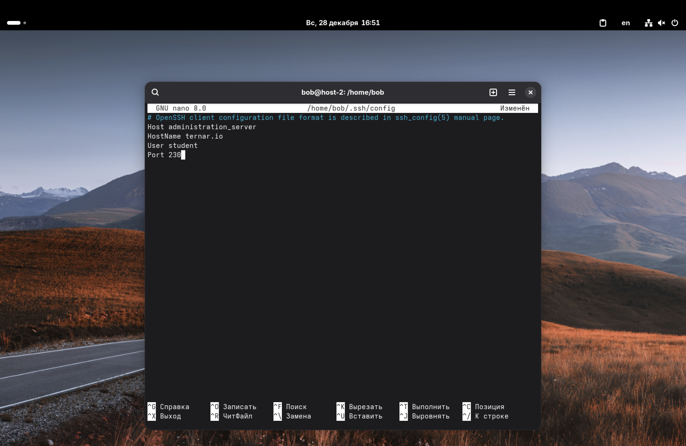
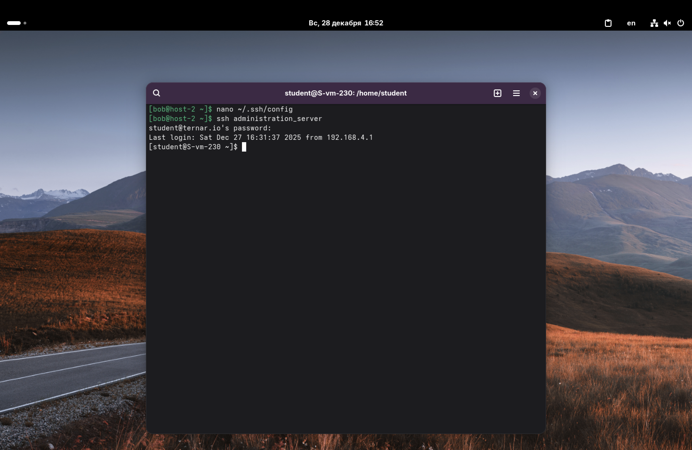

1. Где хранятся пользовательские и системные настройки подключения?

Настройки SSH-клиента хранятся в двух основных местах:
1. Системные настройки (для всех пользователей): `/etc/openssh/ssh_config`;
2. Пользовательские настройки (для текущего пользователя): `~/.ssh/config`.

Пользовательские настройки имеют приоритет над системными. Если файл `~/.ssh/config` отсутствует, его можно создать вручную.

---

2. Что за файл options?

В стандартной терминологии SSH файла с именем options не существует. Как я понял, имеется в виду пользовательский конфигурационный файл: `~/.ssh/config`.

Именно в этом файле содержатся параметры для различных хостов, чтобы упростить процесс подключения. Он позволяет задать такие параметры, как имя хоста, порт, пользователя, путь к ключу и многие другие, привязав их к удобному короткому имени.

---

3. Отредактируйте файл options так, чтобы можно было подключаться не вводя имя пользователя и порт.
4. Назовите подключение удобным для вас способом.

Откроем файл конфигурации: `nano ~/.ssh/config`.

Впишем туда настройки для сервера. В качестве удобного имени (псевдонима) выберем `administration_server`.

---

5. Проверьте работоспособность.

Теперь, чтобы подключиться к серверу, нам не нужно писать длинную строку: `ssh -p 230 student@ternar.io`. Достаточно использовать наш псевдоним: `ssh administration_server`.

