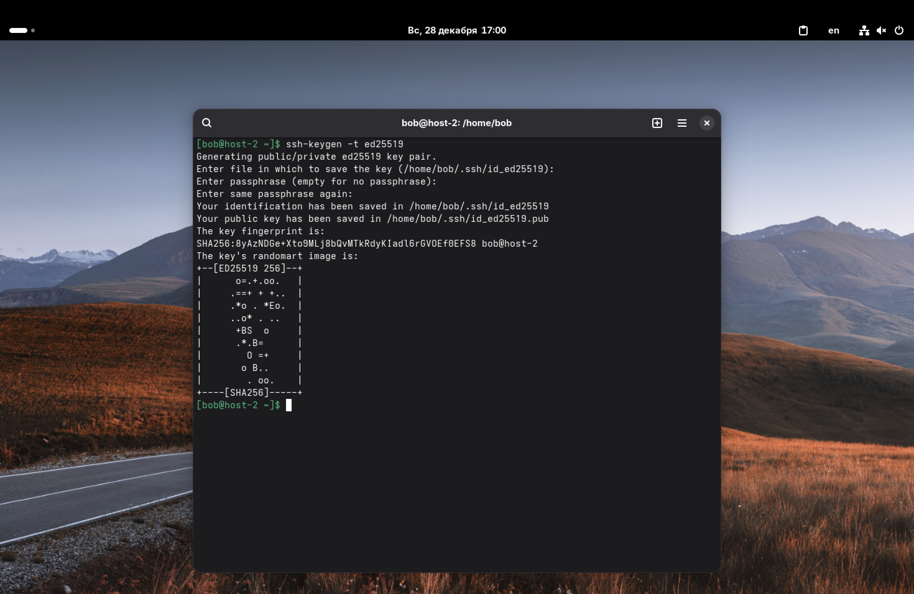
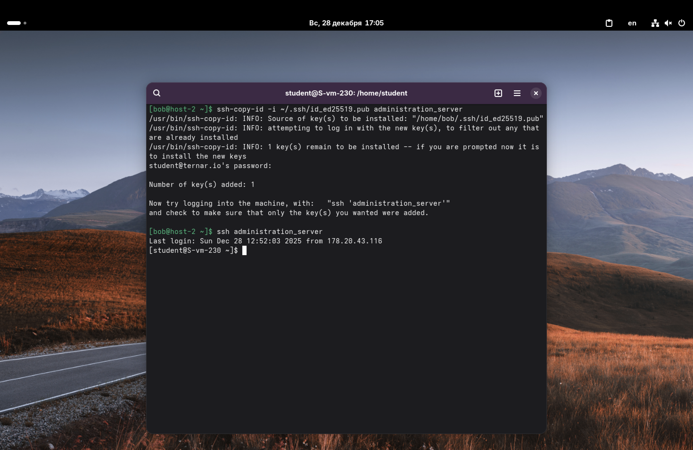
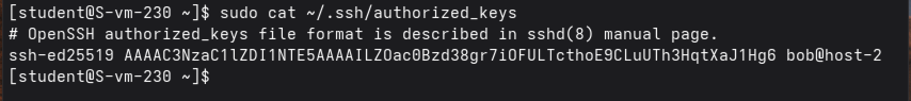
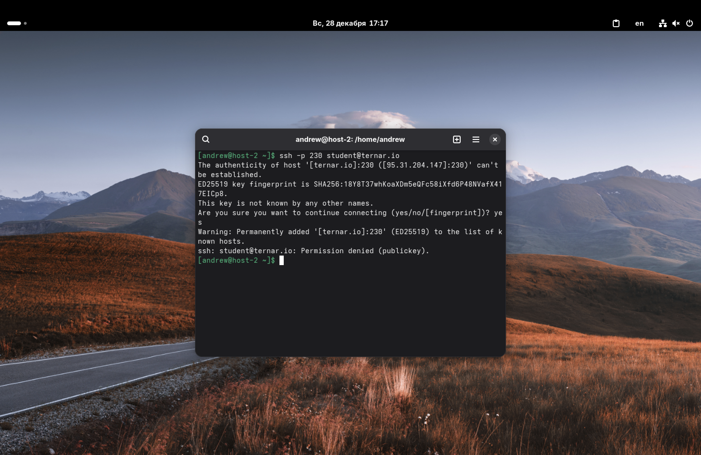

1. Что такое ssh ключи и зачем они нужны?

SSH-ключи – это пара криптографических ключей, используемых для безопасного входа на удаленные сервера без использования пароля.

Пара состоит из двух частей:
1.  *Публичный ключ (Public Key)*: Его мы отправляем на сервер;
2.  *Приватный ключ (Private Key)*: Хранится только у нас на компьютере.

SSH-ключи нужны, чтобы повысить безопасность (ключ практически невозможно подобрать вручную, в отличие от пароля) и для удобства (автоматизация входа скриптами, отсутствие необходимости постоянно вводить пароль).

---

2. Как их создать?
3. Создайте пару публичный/приватный ключ ed_25519, где они хранятся?

Для генерации ключей используется утилита `ssh-keygen`. Чтобы создать ключ *ed25519*, пропишем следующую команду: `ssh-keygen -t ed25519`. Здесь, `-t` – это флаг, который позволяет указать тип шифрования.

Сохраняем файл в путь по умолчанию. Кодовую фразу оставляем пустой (чисто для быстроты и удобства).

По умолчанию ключи сохраняются в скрытой директории ```.ssh``` в домашнем каталоге пользователя:
*   Приватный ключ: ```~/.ssh/id_ed25519```
*   Публичный ключ: ```~/.ssh/id_ed25519.pub```



---

4. Скопируйте публичный ключ на ваш сервер, в каком файле он будет храниться?

Чтобы перенести публичный ключ на сервер, воспользуемся утилитой: `ssh-copy-id`. Итого, учитывая то, что мы настроили файл config для удобного входа на сервер, команда будет выглядеть следующим образом: `ssh-copy-id -i ~/.ssh/id_ed25519.pub administration_server`.

Здесь, `-i` – это флаг, который позволяет указать путь к конкретному публичному ключу, который мы хотим передать.

На стороне сервера публичный ключ автоматически записывается в файл `~/.ssh/authorized_keys`.





---

5. Попробуйте подключиться к серверу, у вас запросили пароль?

Как показано на первом скриншоте из 4 задания, пароль не был запрошен. Всё благодаря SSH-ключам.

---

6. Запретите подключение с паролем для всех пользователей, оставьте только с помощью ключа.

Теперь, когда у нас есть рабочий вход по ключу, вход по паролю можно отключить для безопасности. Для этого на сервере снова отредактируем файл конфигурации:
`sudo nano /etc/openssh/sshd_config`

Найдем параметр `PasswordAuthentication` и изменим его значение на *no*: `PasswordAuthentication no`

Также убедимся, что параметр `PubkeyAuthentication` – это *yes*.

Перезапускаем службу SSH:
`sudo systemctl restart sshd`

Итого, если кто-то попытается подключиться к серверу без ключа (или из-под другого пользователя, или другого компьютера), сервер даже не предложит ввести пароль, а сразу сбросит соединение (с ошибкой *Permission denied (publickey)*).


*P.S. Залогинился из-под другого пользователя и попробовал подключиться к серверу.*
