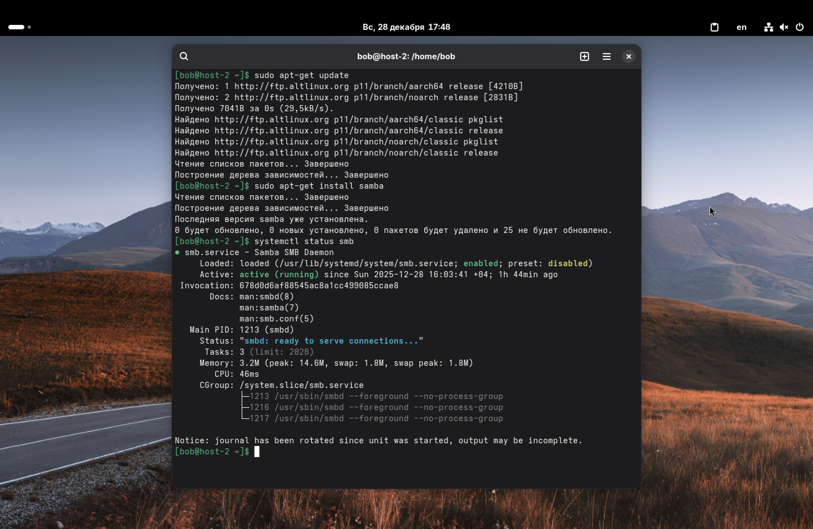
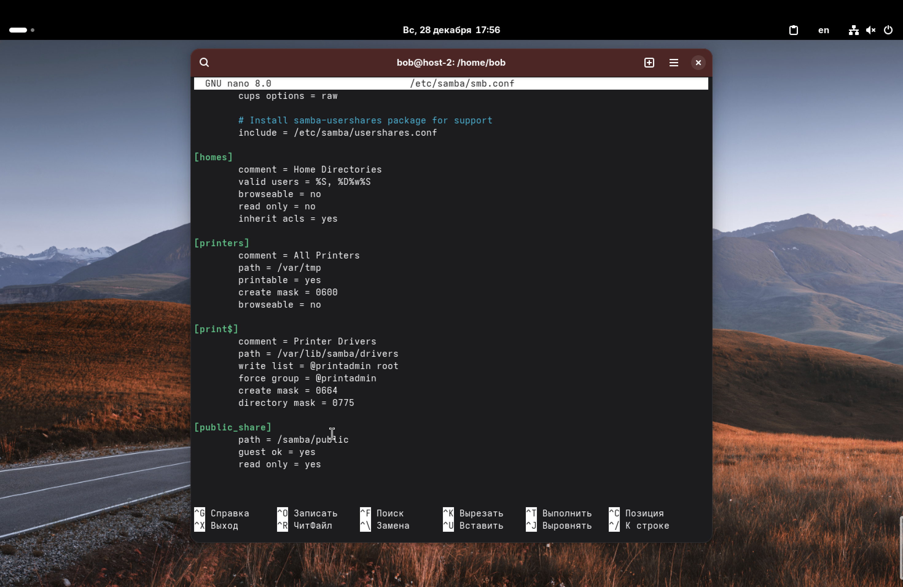
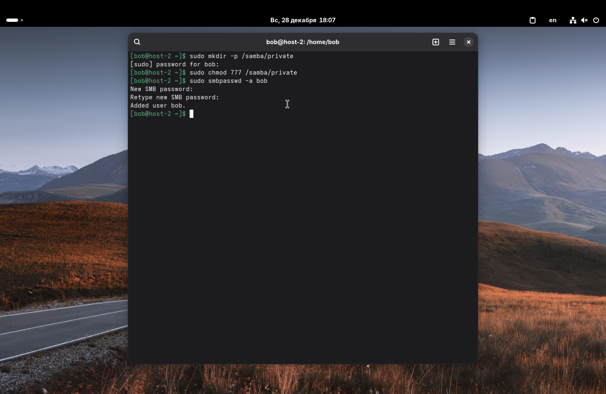
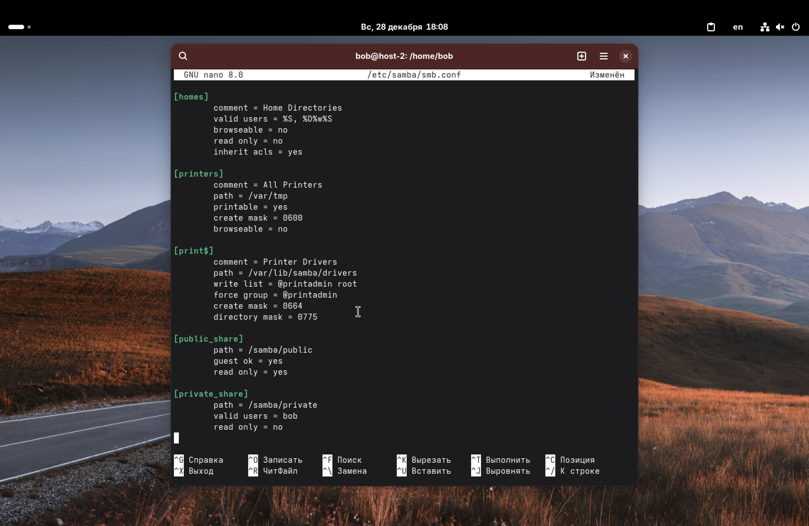
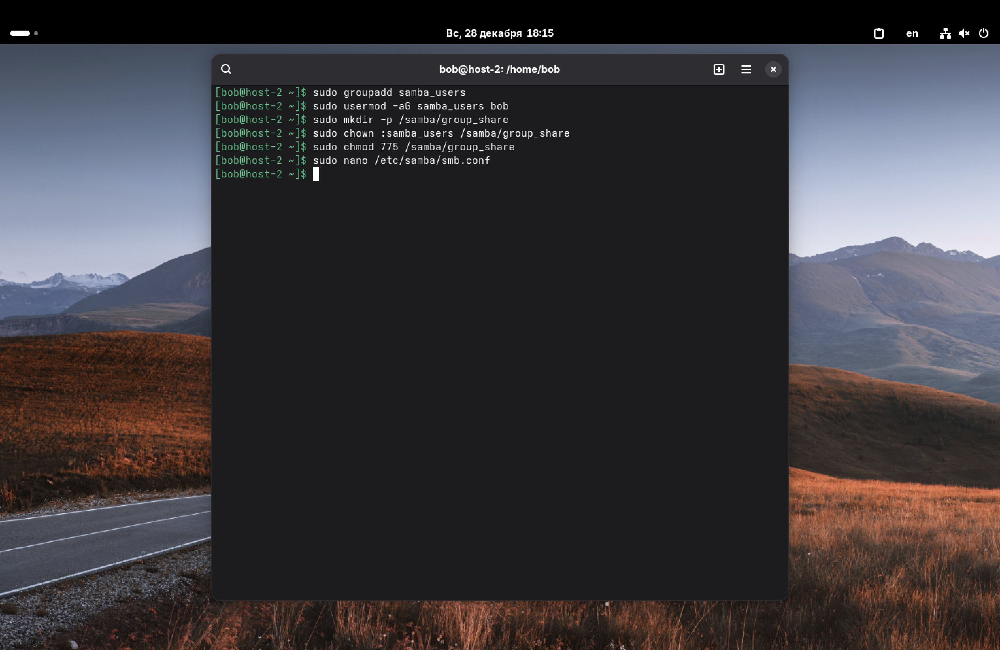
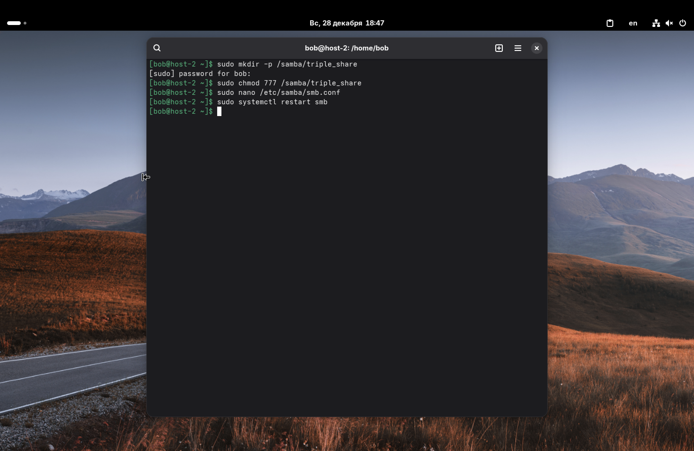
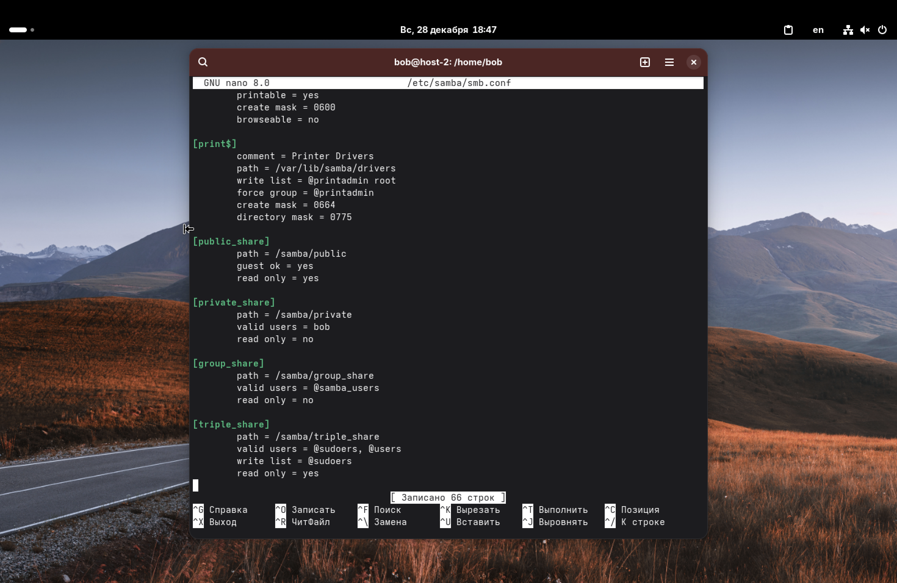

1. Установите пакет samba.

Обновим списки пакетов и установим samba:
`sudo apt-get update`
`sudo apt-get install samba`

После установки проверим, что служба запустилась:
`systemctl status smb`



---

2. Что такое общая папка, зачем она может быть нужна?

Общая папка – это директория на компьютере/сервере, доступ к которой открыт по локальной сети для других пользователей.

Она нужна для удобного обмена файлами между разными компьютерами и операционными системами (например, чтобы скинуть файл с Linux-сервера на Windows-ноутбук) без использования флешек или облачных хранилищ.

---

3. Создайте общую папку без пароля с правами только на чтение файлов.

Создадим директорию, которую будем расшаривать: `sudo mkdir -p /samba/public`

Выдадим права, чтобы к ней мог обратиться кто угодно: `sudo chmod 777 /samba/public`

Теперь отредактируем главный файл конфигурации Samba:
`sudo nano /etc/samba/smb.conf`

В конец файла добавим следующее:
```
[public_share]
	path = /samba/public
	guest ok = yes
	read only = yes
```
*   `guest ok = yes` –  разрешает вход другим (без пароля);
*   `read only = yes` – только чтение.

Сохраняем файл и перезапускаем службу: `sudo systemctl restart smb`




---

4. Создайте общую папку с паролем с правами на чтение и запись.

Создадим новую папку:
`sudo mkdir -p /samba/private`
`sudo chmod 777 /samba/private`

Samba использует свою базу пользователей, поэтому нам нужно создать пароль Samba для нашего текущего пользователя (пусть это будет `bob`): `sudo smbpasswd -a bob`

Снова идем в конфиг `/etc/samba/smb.conf` и добавляем:
```
[private_share]
	path = /samba/private
	valid users = bob
	read only = no
```
*   `valid users` – указывает, кому разрешен доступ;
*   `read only = no` – разрешает запись (то есть и чтение, и запись).

Перезапускаем: `sudo systemctl restart smb`.





---

5. Создайте общую папку с доступом для какой-то группы с полными правами.

Создадим группу `samba_users` и добавим туда нашего пользователя:
`sudo groupadd samba_users`
`sudo usermod -aG samba_users bob`

Создаем папку: `sudo mkdir -p /samba/group_share`
Меняем владельца группы у папки на нашу новую группу и даем права на запись для группы:
`sudo chown :samba_users /samba/group_share`
```sudo chmod 775 /samba/group_share```

Добавляем в конфиг:
```ini
[group_share]
   path = /samba/group_share
   valid users = @samba_users
   read only = no
```
Знак `@` перед именем означает, что мы указываем именно группу, а не пользователя.



---

6. Создайте общую папку в которой у одной группы будет полный доступ, а у другой только доступ на чтение. Третья группа не должна иметь к ней доступа.

Пусть, у нас есть три группы:
1.  `sudoers` (группа с полным доступом)
2.  `users` (только чтение)
3.  `guests` (нет доступа)

Создадим папку:
`sudo mkdir -p /samba/triple_share`
`sudo chmod 777 /samba/triple_share`

В конфиге `/etc/samba/smb.conf` пропишем такую логику:

```
[triple_share]
   path = /samba/triple_share
   valid users = @sudoers, @users
   write list = @sudoers
   read only = yes
```

Здесь,
 - `valid users = @sudoers, @users`: Мы пускаем в папку только эти две группы. Группа `guests` (и любые другие) не указана здесь, поэтому доступа у них не будет впринципе;
 - `read only = yes`: По умолчанию для всех, кто зашел, папка открыта только для чтения.
 - `write list = @sudoers`: Это исключение из правила выше. Для группы `sudoers` запись разрешена.

Таким образом: `sudoers` читают и пишут, `users` только читают, остальные не имеют доступа.




