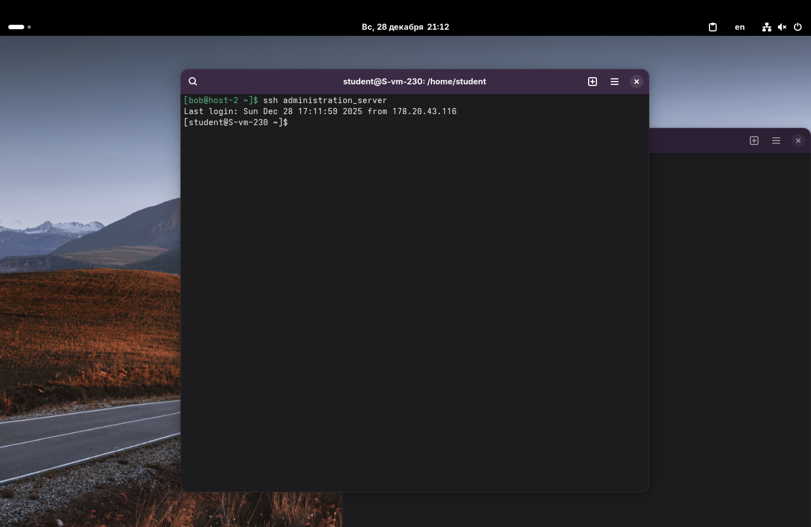
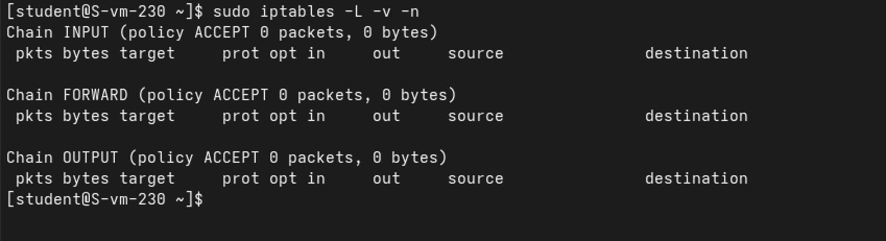
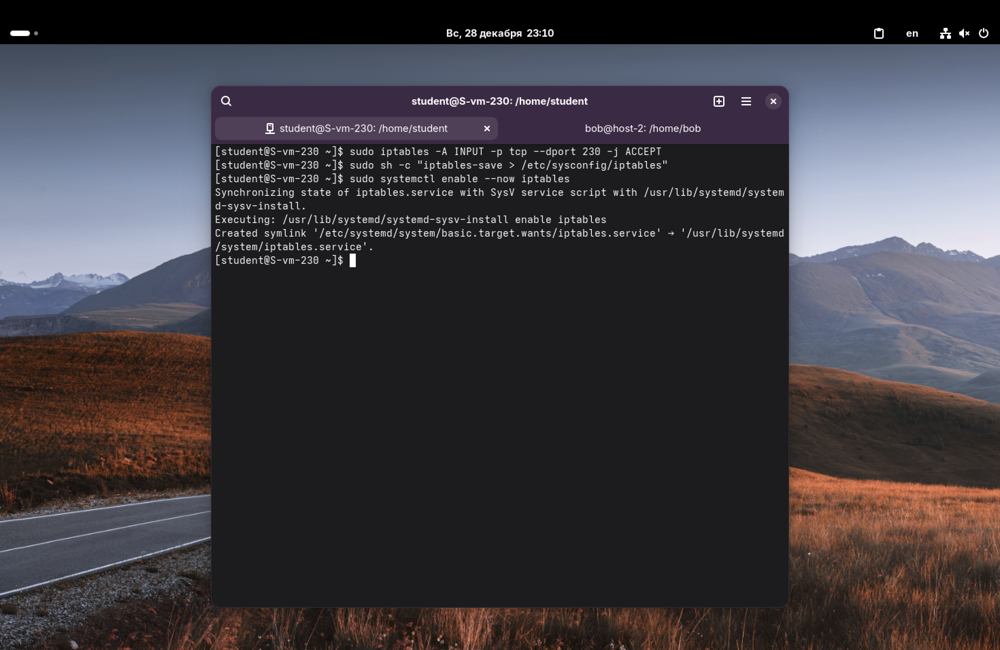

1. Установите iptables.

Установим iptables:
`sudo apt-get update`
`sudo apt-get install iptables`

---

2. Проверьте осталась ли возможность подключения по ssh к вашему серверу.
3. Почему может пропасть такая возможность?

После базовой установки iptables её правила обычно пусты, и настройки по умолчанию – это разрешить всё (ACCEPT), поэтому подключение работает.

Проверим текущие правила.

Возможность подключения пропадёт, если мы сменим политику для входящего трафика на DROP (запретить всё), не добавив перед этим разрешающее правило для SSH. Команда, которая отрубает доступ: `sudo iptables -P INPUT DROP`.

Если выполнить её до того, как открыт порт, сервер перестанет принимать любые входящие пакеты, включая пакеты от моей SSH-сессии.

---

4. Откройте нужный порт на сервере чтобы восстановить подключение.

Пропишем команду, чтобы разрешить трафик на мой порт (230):
`sudo iptables -A INPUT -p tcp --dport 230 -j ACCEPT`

Здесь,
- `-A INPUT`: Добавить правило в цепочку входящего трафика (Append);
- `-p tcp`: Указываем протокол (SSH работает по TCP);
- `--dport 230`: Destination port (порт назначения);
- `-j ACCEPT`: Действие – принять пакет.

Теперь, даже если политика по умолчанию станет DROP, возможность подключения останется.

---

5. Это будет udp или tcp порт?

SSH использует протокол TCP. Это связано с тем, что для удаленного управления критически важна надежность доставки данных, правильный порядок пакетов и проверка целостности. Протокол UDP (который работает по принципу "отправил и забыл") для таких целей не подходит.

---

6. Сохраняются ли записанные вами правила после перезагрузки?

Нет, по умолчанию правила iptables хранятся только в оперативной памяти. После перезагрузки сервера все созданные нами правила (и правило для 230 порта) исчезнут, и настройки сбросятся к дефолтным.

---

7. Как их сохранить?

Будем сохранять настройки в стандартный для этого файл: `/etc/sysconfig/iptables`. 

Применим данную команду: `sudo sh -c "iptables-save > /etc/sysconfig/iptables"`. Соответственно, теперь, вывод текущих правил будет перенаправляться в этот файл.
В команде,
- *sh* – нужен для того, чтобы запустить новую командную оболочку с рут-правами;
- флаг *-с* – чтобы выполнилась команда в кавычках.

И пропишем данную команду для автозагрузки сервиса iptables (и, соответственно, автозагрузки правил): `sudo systemctl enable --now iptables`

