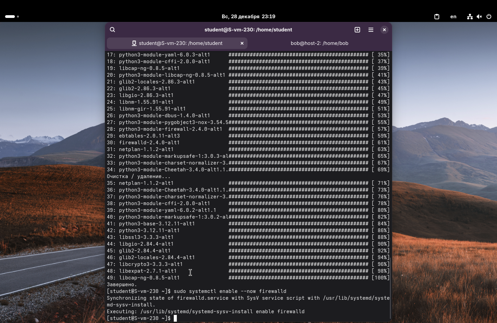
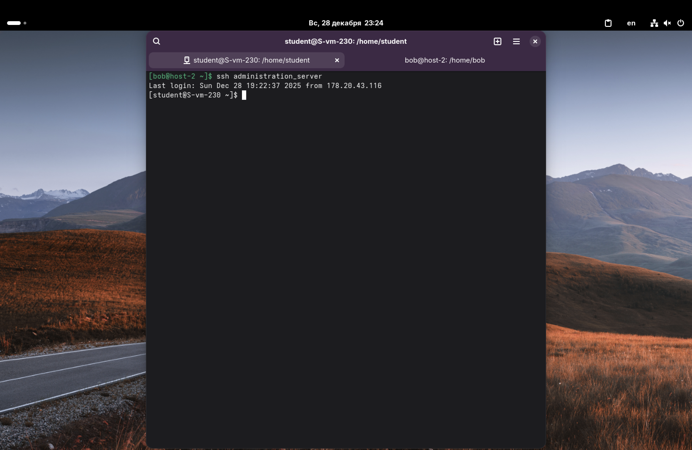
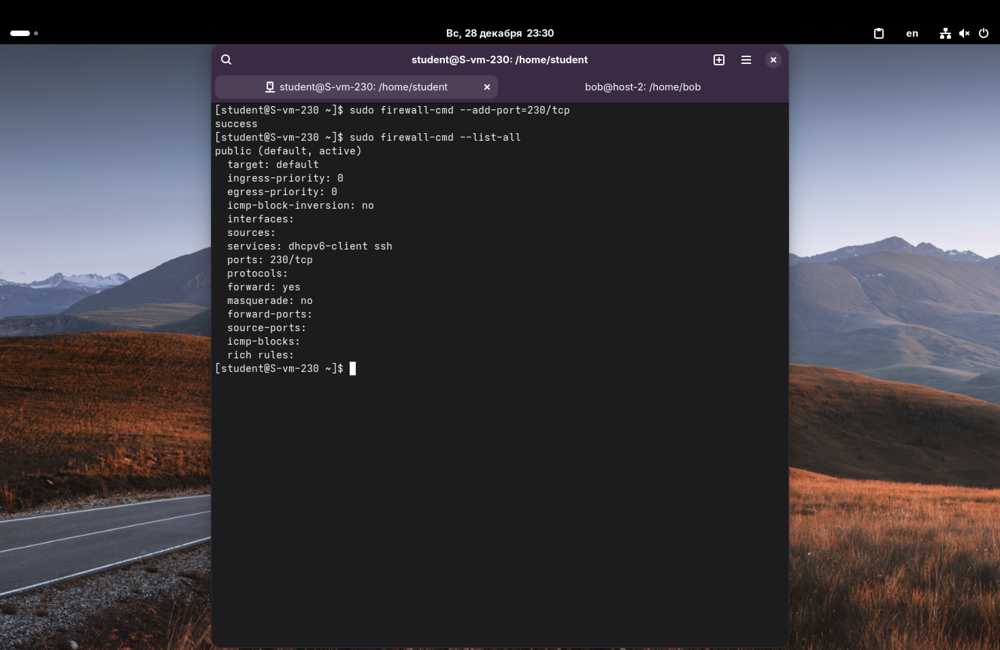
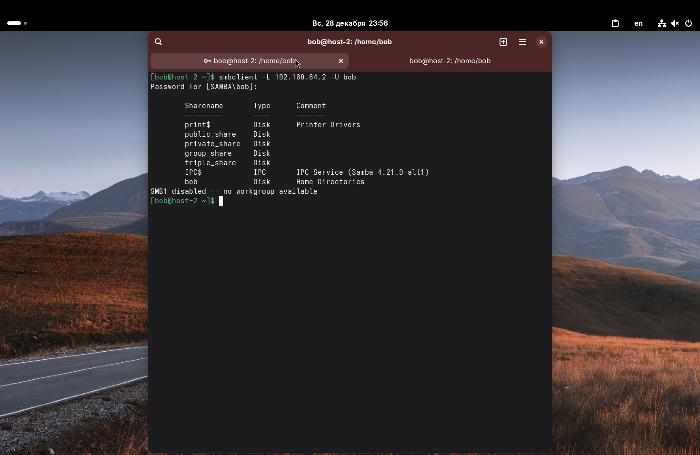
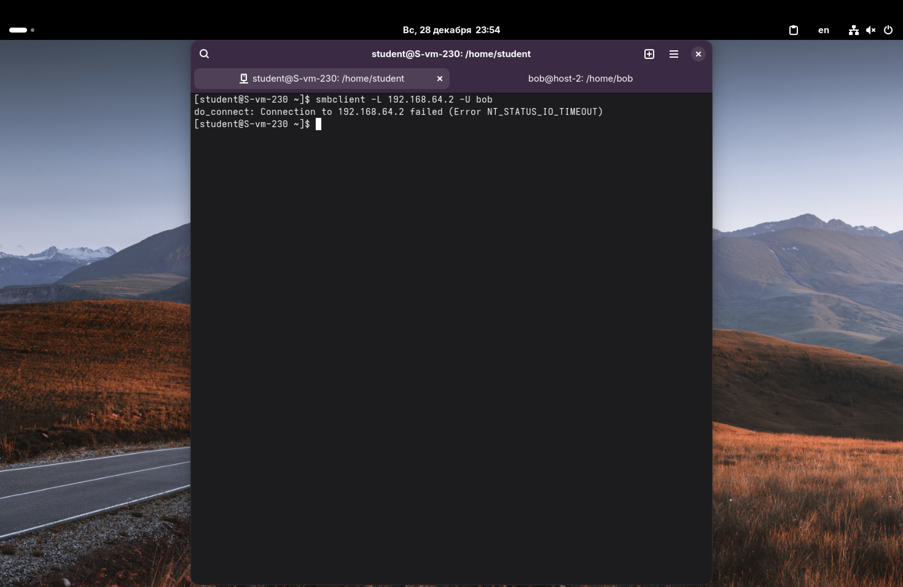

1. Удалите iptables и установите firewalld.

Удаляем iptables и установим firewalld:
`sudo apt-get remove iptables`
`sudo apt-get install firewalld`

После установки запустим службу и добавим её в автозагрузку:
`sudo systemctl enable --now firewalld`



---

2. Попробуйте так же проверить возможность подключения по ssh.
3. Если её нет, то откройте порт.

`firewalld` по умолчанию блокирует все входящие соединения, кроме разрешенных (обычно это служба ssh на 22 порту и dhcp), а т. к. мой SSH-сервер настроен на 230 порт, то по идее подключение для новой сессии должно быть недоступно. Но у меня подключение проходит.



Но всё равно разберёмся, как открыть порт. Чтобы восстановить доступ, нужно добавить правило для моего порта (230). Пропишем команду: `sudo firewall-cmd --add-port=230/tcp`

Здесь,
- `firewall-cmd` – основная утилита управления;
- `--add-port` – открывает порт;
- `/tcp` – указывает протокол.

---

4. Выведите список открытых портов с помощью firewall-cmd.

Проверить текущие настройки можно командой:
`sudo firewall-cmd --list-all`

Она покажет активную зону (обычно public), подключенные интерфейсы, разрешенные службы и порты. Видим в строке `ports` открытый порт – `230/tcp`.



---

5. Можно ли там добавить порты по названию сервиса?

Да, это одна из особенностей `firewalld`. Можно использовать не только номера портов, но и названия служб. Например, команда: `sudo firewall-cmd --add-service=https` автоматически откроет 443 порт.

*Если попробовать добавить сервис `ssh` (`--add-service=ssh`), фаервол откроет стандартный 22-й порт. Т. к. порт в конфиге sshd был изменён на 230, то стандартный сервис мне не поможет (либо нужно редактировать XML-описание самого сервиса ssh в настройках firewalld).*

---

6. На вашей Локальной виртуальной машине попробуйте подключиться к серверу samba из предыдущих заданий.
7. Если не получилось, то откройте нужные порты.

При попытке подключиться к общей папке с локальной машины проблем не возникает (ведь firewalld мы устанавливали на сервере для пользователя student, а не на локальной машине).



Следовательно, пробуем подключиться к серверу Samba из-под student'а на сервере. Видим, что соединение отваливается по таймауту. Всё потому, что `firewalld` блокирует порты SMB (139 и 445).



Чтобы это исправить, откроем доступ сразу к нужным нам службам:
`sudo firewall-cmd --add-service=samba`
`sudo firewall-cmd --add-service=samba-client`

Теперь проверим список разрешенных сервисов:
```sudo firewall-cmd --list-services```
В списке появились `samba` и `samba-client`. Можно подключаться.

---

8. Сделайте так, чтобы изменения были постоянными.

Все команды, которые были введены выше, действуют только до перезагрузки. Это удобно для тестов: если ошибся или что-то пошло не так, достаточно перезагрузить сервер.

Чтобы сохранить правила навсегда, нужно продублировать их с флагом `--permanent` или сохранить текущую конфигурацию. Пропишем правила для порта 230 и самбы с флагом `--permanent`:

`sudo firewall-cmd --permanent --add-port=230/tcp`
`sudo firewall-cmd --permanent --add-service=samba`
`sudo firewall-cmd --permanent --add-service=samba-client`

После этого нужно перезагрузить правила фаервола, чтобы применить изменения:
`sudo firewall-cmd --reload`

Теперь все будет сохранено, даже после перезагрузки сервера.
