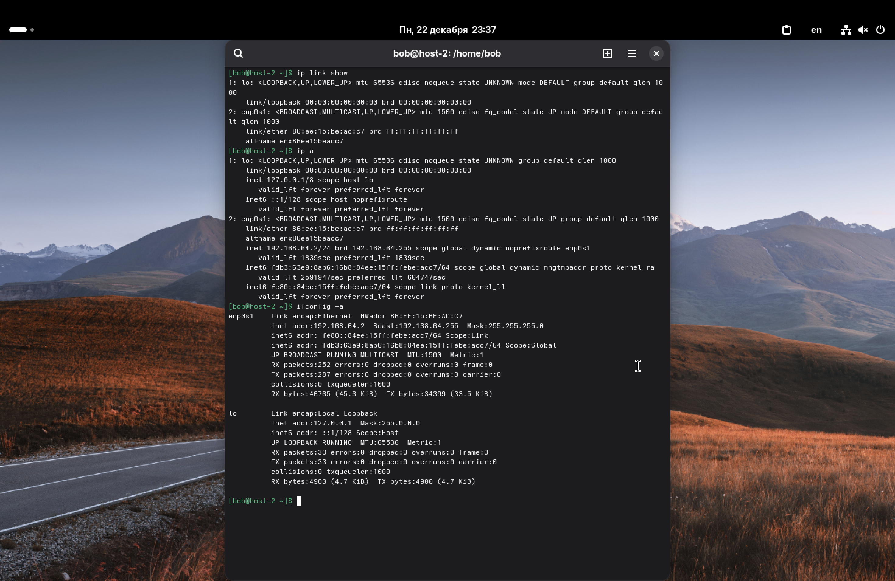
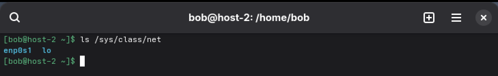
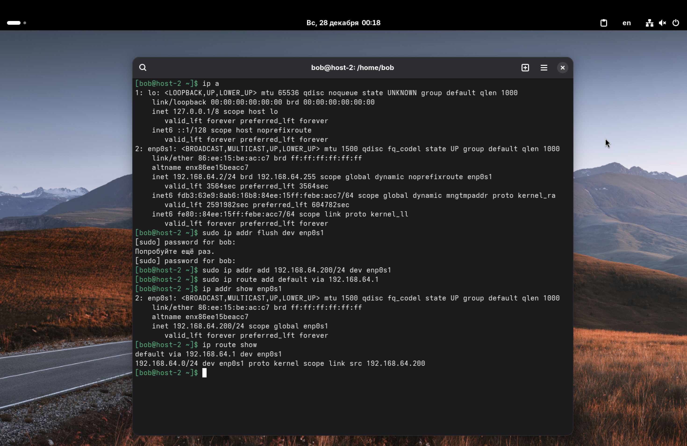
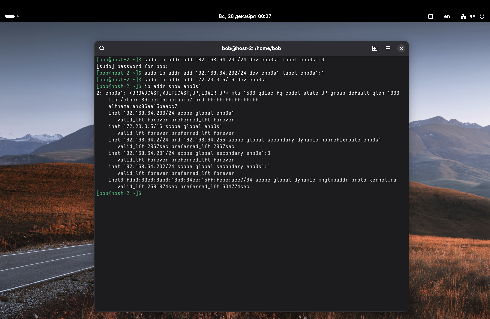
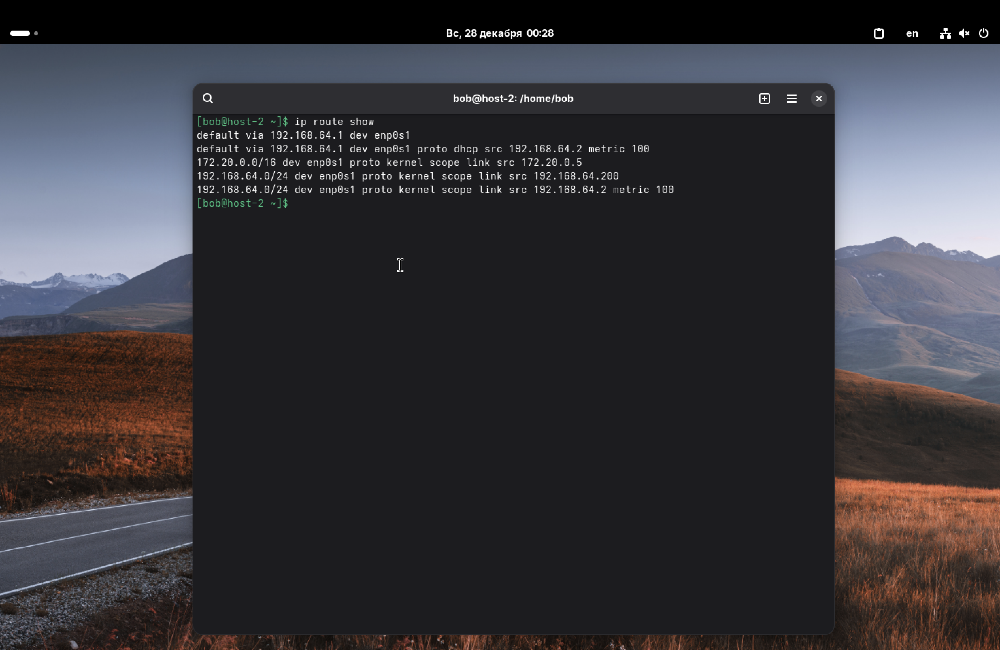
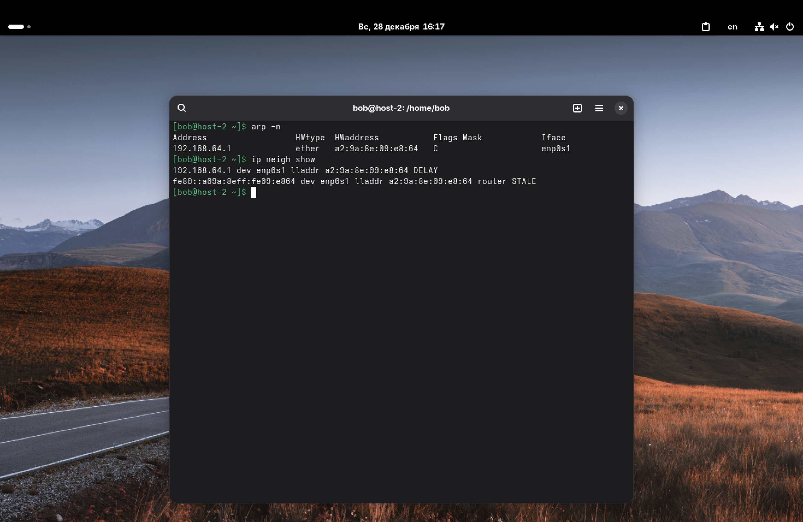

1. Выведите список интерфейсов, какими способами можно это сделать?

Один из способов – это использование команды: `ip link show`

Также часто используют команду: `ip a` (или `ip addr show`). Эта команда показывает как список интерфейсов, так и присвоенные им IP-адреса.

Можно ещё вывести список интерфейсов таким образом:
`ifconfig -a`

Также, список интерфейсов можно увидеть просто просмотрев системную директорию:
`ls /sys/class/net`

---

2. Попробуйте изменить ip адрес.

Сначала посмотрим текущую конфигурацию, чтобы знать имя интерфейса (в моем случае это `enp0s1`): `ip a`

Теперь изменим адрес (изменения через консоль временные и сбросятся после перезагрузки). Сначала очистим текущий адрес (чтобы не было конфликтов):
`sudo ip addr flush dev enp0s1`

Теперь назначим новый адрес (напр., `192.168.64.200` с маской `/24`):
`sudo ip addr add 192.168.64.200/24 dev enp0s1`

После смены IP часто нужно заново указывать шлюз по умолчанию, чтобы интернет заработал: `sudo ip route add default via 192.168.64.1`

Проверяем результат:
`ip addr show enp0s1`
`ip route show`

---

3. Попробуйте добавить несколько ip адресов на сетевую карту.

В различных дистрибутивах Linux (в том числе и в Alt-Linux) можно назначать одному интерфейсу несколько адресов. Добавим пару адресов с метками, чтобы их было проще различать в выводе:
`sudo ip addr add 192.168.64.201/24 dev enp0s1 label enp0s1:0`
`sudo ip addr add 192.168.64.202/24 dev enp0s1 label enp0s1:1`

И добавим еще один адрес из совершенно другой подсети без метки:
`sudo ip addr add 172.20.0.5/16 dev enp0s1`

Проверим:
`ip addr show enp0s1`

---

4. Выведите список маршрутов.

Для просмотра таблицы маршрутизации введём команду: `ip route show`.
Здесь, `default` – это маршрут по умолчанию (интернет), и маршруты к локальным сетям.

---

5. Выведите arp таблицу.

Чтобы посмотреть таблицу arp, можно использовать команду `arp -n`. При этом, существует другая команда из утилиты ip: `ip neigh show`. Она выводит всё то же самое, только в таблицу добавляется ещё и тип подключения. 

---

6. Что такое ip адрес?

*IP-адрес (Internet Protocol Address)* – это уникальный числовой идентификатор устройства в компьютерной сети, работающей по протоколу IP. Он выполняет две функции: идентифицирует устройства, подключенные к сети и показывает их местонахождение в сети.

---

7. Для чего нужны маршруты?

Маршруты нужны для того, чтобы система знала, куда отправлять пакеты c данными, предназначенные для разных адресатов. Если компьютер хочет отправить данные на IP, который не находится в его локальной сети, он смотрит в таблицу маршрутизации:
*   Если есть конкретный маршрут к этой сети, то пакет идет туда;
*   Если нет, то пакет отправляется на "шлюз по умолчанию" (Default Gateway), который уже сам решает, что делать дальше.
Без маршрутов компьютер мог бы взаимодействовать только с соседями по проводу.

---

8. Что за протокол arp?

*ARP (Address Resolution Protocol)* – это протокол, который связывает IP-адрес с MAC-адресом. Когда мы хотим отправить пакет на `192.168.64.201` (условно), сетевая карта не понимает IP-адресов, ей нужен физический MAC-адрес получателя. Компьютер делает ARP-запрос: "У кого IP 192.168.64.201?", и нужное устройство отвечает своим MAC-адресом.

---

9. Что такое dhcp?

*DHCP (Dynamic Host Configuration Protocol)* – это протокол автоматической настройки узла. Он позволяет устройству при подключении к сети автоматически получить IP-адрес, маску подсети, шлюз и DNS-серверы от роутера, избавляя пользователя от ручной настройки.

---

10. Что такое dns?

*DNS (Domain Name System)* – это система, которая переводит понятные человеку доменные имена (напр., `yandex.ru`) в понятные компьютеру IP-адреса (например, `142.250.74.46`).

---

11. Как называется один из протоколов синхронизации времени?

Самый распространенный – *NTP (Network Time Protocol)*. Он используется для синхронизации часов компьютера с эталонными серверами времени с точностью до миллисекунд. Также существуют:
*   *SNTP (Simple NTP)* – упрощенная версия;
*   *PTP (Precision Time Protocol)* – для сверхточной синхронизации в локальных сетях (используется в промышленности, телекоме).

---

12. Что такое широковещательный запрос, зачем он нужен?

*Широковещательный запрос* – это отправка пакета данных сразу всем участникам сети. Нужен, когда отправитель не знает, кто именно ему нужен.

---

13. Какой адрес является широковещательным?

*   На канальном уровне (MAC): `FF:FF:FF:FF:FF:FF`;
*   На сетевом уровне (IP):
    *   Глобальный широковещательный адрес (в пределах текущей сети): `255.255.255.255`;
    *   Направленный бродкаст (для конкретной подсети): берется адрес сети, и все хостовые биты ставятся в 1.
    *Пример:* Для сети `192.168.1.0/24` широковещательным адресом будет `192.168.1.255`.

---

14. Какие ещё параметры можно задать сетевой карте?

Помимо IP, маски и шлюза, можно настроить:
*   *MTU (Maximum Transmission Unit)* – максимальный размер пакета;
*   *MAC-адрес* – программная смена физического адреса;
*   *Скорость и режим дуплекса* – например, 100Мбит или 1Гбит, полудуплекс или полный дуплекс;
*   *Promiscuous mode* – "неразборчивый режим" для прослушивания всего трафика.

---

15. Что такое маска подсети? Зачем она нужна?

*Маска подсети* – это шаблон (битовая маска), который показывает, какая часть IP-адреса отвечает за адрес сети, а какая – за адрес конкретного хоста. Технически, это последовательность единиц и нулей.

Пример: Маска `255.255.255.0` (или /24) означает, что первые три числа – это сеть, а последнее – номер компьютера. 

Она нужна маршрутизаторам, чтобы понимать, находится получатель в той же локальной сети (можно слать напрямую) или в другой (нужно слать на шлюз).
